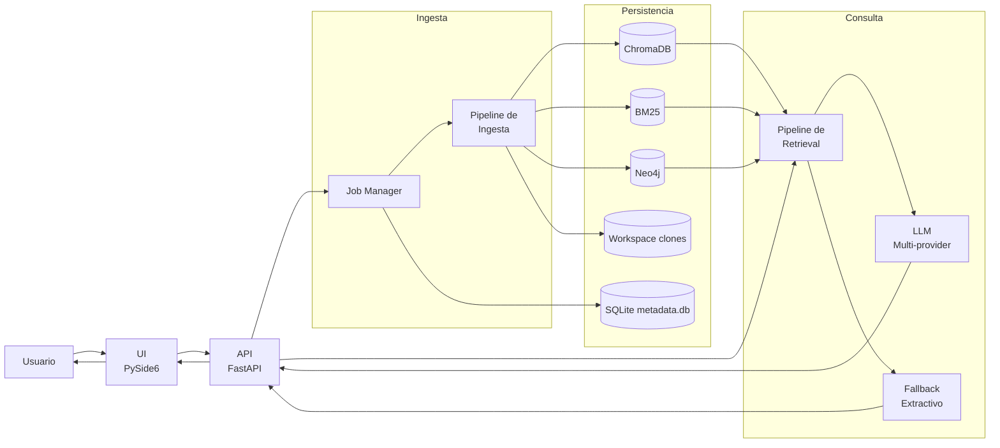
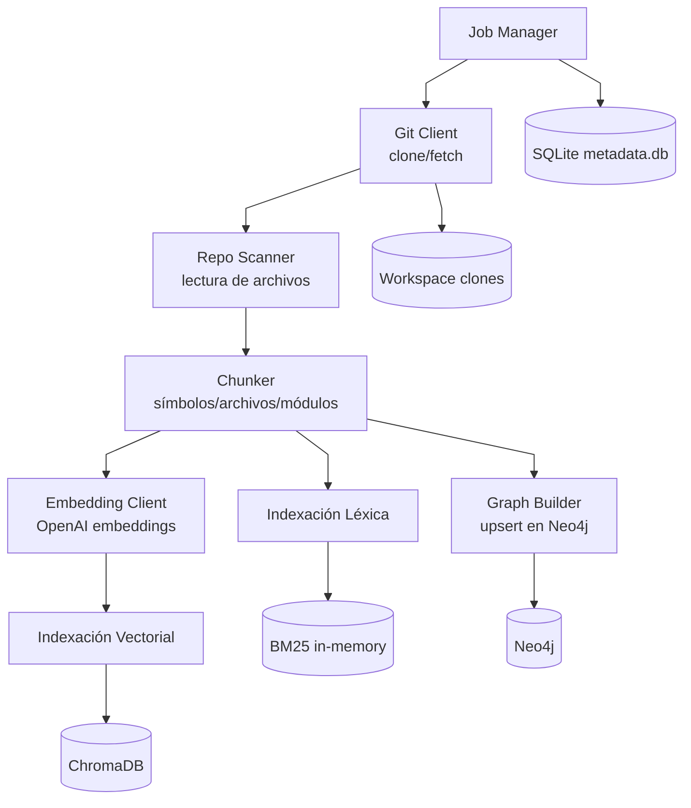
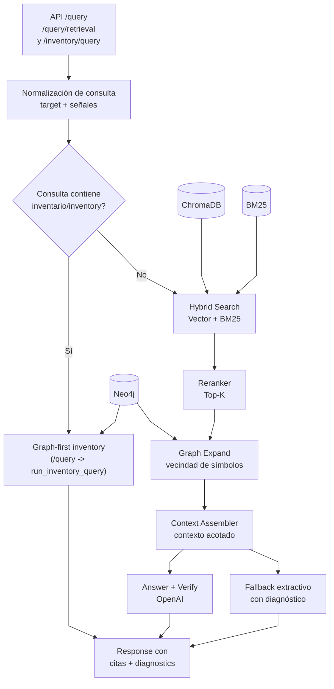

# RAG Hybrid Response Validator

RAG Hybrid Response Validator es una solución de análisis de repositorios basada en Hybrid RAG
(Vector + BM25 + Grafo) para responder preguntas sobre código con evidencia
verificable (archivos y líneas).

## Tabla de Contenidos

- [Descripción General](#descripción-general)
- [Características Principales](#características-principales)
- [Arquitectura del Sistema](#arquitectura-del-sistema)
- [Instalación](#instalación)
- [Quick Start Rancher](#quick-start-rancher)
- [Configuración](#configuración)
- [Ejemplos de Uso](#ejemplos-de-uso)
- [API](#api)
- [Extractores de Simbolos](#extractores-de-simbolos)
- [Estructura del Proyecto](#estructura-del-proyecto)
- [Testing](#testing)
- [Benchmark de Latencia](#benchmark-de-latencia)
- [QA Manual (UI)](#qa-manual-ui)
- [Notas de Versión](#notas-de-versión)
- [Troubleshooting](#troubleshooting)

## Descripción General

El sistema permite:

1. Ingestar repositorios Git (GitHub/Bitbucket).
2. Construir índices híbridos para búsqueda semántica y exacta.
3. Construir y consultar un grafo de conocimiento del código.
4. Responder consultas en lenguaje natural con citas verificables.

Se incluye API (FastAPI), UI de escritorio (PySide6), almacenamiento vectorial
(ChromaDB), índice lexical (BM25) y base de grafo (Neo4j).

## Características Principales

- Ingesta asíncrona por job con tracking de estado y logs.
- Indexación híbrida: símbolos, archivos y módulos.
- Recuperación robusta multi-stack con inventario estructural por grafo para
   consultas tipo “todos los X”.
- Inventario con expansión léxica genérica (singular/plural y equivalentes
   multi-idioma como `service/servicio`) para mejorar recall.
- Soporte de expansión GraphRAG para enriquecer contexto.
- Respuestas con citas y diagnósticos (`retrieved`, `reranked`, `graph_nodes`,
   etc.).
- Diagnóstico explícito de fallback (`fallback_reason`, `verify_valid`,
   `llm_error`) para diferenciar configuración, verificación y errores de
   generación.
- Fallback seguro cuando no hay configuración de LLM.

## Arquitectura del Sistema

### Componentes

- UI: PySide6 (`ingesta`, `consulta`, `evidencias`).
- API: FastAPI (`/repos/ingest`, `/jobs/{id}`, `/query`, `/query/retrieval`, `/inventory/query`, `/repos`, `/providers/models`, `/repos/{repo_id}/status`, `/health/storage`, `/admin/reset`).
- Ingesta: clonación, escaneo, chunking, embeddings, BM25, grafo.
- Retrieval: fusión vectorial + BM25 + expansión de grafo + ensamblado de
   contexto.
- LLM: multi-provider (`openai`, `anthropic`, `gemini`, `vertex_ai`) para
   respuesta y verificación anti-alucinación.

### Diagramas (Mermaid)

#### 1) Vista general



#### 2) Pipeline de ingesta (detalle)



#### 3) Pipeline de retrieval + respuesta (detalle)



### Relaciones clave

- **UI (PySide6)** consume la **API (FastAPI)** para ingesta, polling de jobs y consultas.
- **Ingesta** construye tres vistas complementarias del código: vectorial (**Chroma**), léxica (**BM25**) y relacional (**Neo4j**).
- **Routing de /query** usa inventory graph-first solo cuando la consulta contiene `inventario`/`inventory`; en otro caso usa retrieval híbrido + síntesis LLM.
- **`/query/retrieval`** ejecuta retrieval híbrido sin síntesis LLM y también reutiliza inventory graph-first cuando detecta intención de inventario.
- **Retrieval híbrido** combina esas fuentes, rerankea, expande grafo y arma contexto antes de responder.
- **LLM** genera y verifica; si falla configuración/verificación/generación, entra **fallback extractivo** con citas y `diagnostics`.
- **SQLite + workspace** guardan estado operativo (jobs, repos y clones locales).

## Instalación

### Requisitos

- Python 3.10+
- Git
- Rancher Desktop (recomendado para Neo4j) con `nerdctl compose`

> Compatibilidad: si tu entorno usa Docker Desktop, puedes ejecutar los mismos
> servicios con `docker compose`.

### Pasos

1. Instalar dependencias:

    ```bash
    pip install -r requirements.txt
    ```

2. Crear archivo de entorno:

    ```bash
    copy .env.example .env
    ```

3. Levantar servicios auxiliares:

    ```bash
   nerdctl compose up -d
    ```

   Verificación rápida del runtime antes de levantar Compose:

   ```bash
   nerdctl version
   nerdctl compose version
   ```

   Alternativa compatible (Docker Desktop):

   ```bash
   docker compose up -d
   ```

   Opción recomendada para equipos mixtos (autodetecta runtime):

   ```powershell
   ./scripts/compose_neo4j.ps1 up
   ```

> Redis no es requerido en la implementación actual. Se considera opcional/futuro
> para escenarios de escalado de jobs con colas distribuidas.

## Quick Start Rancher

Flujo recomendado en Windows para operar Neo4j sin fricción entre runtimes:

1. Levantar Neo4j (autodetección Rancher/Docker):

   ```powershell
   ./scripts/compose_neo4j.ps1 up
   ```

2. Verificar estado del contenedor:

   ```powershell
   ./scripts/compose_neo4j.ps1 ps
   ```

3. Verificar puerto Bolt en host (`17687`):

   ```powershell
   Test-NetConnection 127.0.0.1 -Port 17687
   ```

4. Revisar logs de Neo4j:

   ```powershell
   ./scripts/compose_neo4j.ps1 logs
   ```

5. Detener servicios cuando termines:

   ```powershell
   ./scripts/compose_neo4j.ps1 down
   ```

## Configuración

Variables relevantes en `.env`:

- `LLM_PROVIDER`: proveedor para answer/verifier (`openai`, `anthropic`, `gemini`, `vertex_ai`).
- `LLM_ANSWER_MODEL`, `LLM_VERIFIER_MODEL`: modelos LLM por defecto.
- `LLM_VERIFY_ENABLED`: habilita/deshabilita verificación LLM posterior a la respuesta.
- `EMBEDDING_PROVIDER`: proveedor de embeddings (`openai`, `anthropic`, `gemini`, `vertex_ai`).
- `EMBEDDING_MODEL`: modelo de embeddings por defecto.
- `ANTHROPIC_API_KEY`, `GEMINI_API_KEY`, `VERTEX_AI_API_KEY`.
- `VERTEX_AI_PROJECT_ID`, `VERTEX_AI_LOCATION`.
- `OPENAI_API_KEY`: clave API de OpenAI.
- `OPENAI_EMBEDDING_MODEL`, `OPENAI_ANSWER_MODEL`, `OPENAI_VERIFIER_MODEL`.
- `OPENAI_VERIFY_ENABLED`: compatibilidad heredada para verificación (fallback).
- `CHROMA_PATH`: ruta persistente de Chroma.
- `NEO4J_URI`, `NEO4J_USER`, `NEO4J_PASSWORD`.
- `REDIS_URL` (opcional/futuro): endpoint para cola de jobs distribuida.
- `WORKSPACE_PATH`: ruta de repos clonados.
- `MAX_CONTEXT_TOKENS`, `GRAPH_HOPS`.
- `QUERY_MAX_SECONDS`: presupuesto total por consulta en API.
- `OPENAI_TIMEOUT_SECONDS`: timeout máximo por llamada OpenAI (answer/verify).
- `UI_REQUEST_TIMEOUT_SECONDS`: timeout HTTP de la UI hacia API.
- `INVENTORY_PAGE_SIZE`, `INVENTORY_MAX_PAGE_SIZE`: paginación para inventario.
- `INVENTORY_ALIAS_LIMIT`, `INVENTORY_ENTITY_LIMIT`: límites de expansión de inventario.
- `SCAN_MAX_FILE_SIZE_BYTES` (obligatoria): tamaño máximo por archivo durante escaneo de ingesta.
- `SCAN_EXCLUDED_DIRS` (obligatoria): carpetas excluidas de la ingesta (CSV).
- `SCAN_EXCLUDED_EXTENSIONS` (obligatoria): extensiones excluidas de la ingesta (CSV).
- `SCAN_EXCLUDED_FILES` (opcional): nombres o rutas relativas de archivos a excluir (CSV).
- `SYMBOL_EXTRACTOR_V2_ENABLED`: activa extractor modular por lenguaje para spans completos (`true` por defecto). Usa `false` para rollback al modo legacy de ventana fija.

## Extractores de Simbolos

La arquitectura modular de extraccion por lenguaje, estrategia de registro para
nuevos lenguajes y recomendaciones de pruebas se documenta en:

- `docs/SYMBOL_EXTRACTORS.md`

### Filtros de escaneo de ingesta (obligatorios)

Desde esta versión, la ingesta no usa valores por defecto en código para filtros de escaneo.
Debes definir explícitamente estas variables en `.env`:

```dotenv
SCAN_MAX_FILE_SIZE_BYTES=200000
SCAN_EXCLUDED_DIRS=.git,node_modules,dist,build,venv,.venv,__pycache__,.idea,.vscode,target,out,bin,obj,.gradle,.m2,.pytest_cache,.mypy_cache
SCAN_EXCLUDED_EXTENSIONS=.png,.jpg,.jpeg,.gif,.webp,.ico,.mp3,.mp4,.wav,.ogg,.pdf,.zip,.tar,.gz,.7z,.rar,.jar,.war,.ear,.class,.dll,.exe,.so,.dylib,.o,.a,.bin,.sqlite,.db
SCAN_EXCLUDED_FILES=.gitignore,.env
```

Si falta alguna, la ingesta falla al iniciar con error de configuración.

### Compatibilidad multi-provider

- La UI permite elegir provider/modelo por operación para ingesta y consulta.
- La API mantiene los endpoints de operación (`/repos/ingest`, `/query`,
   `/query/retrieval`, `/inventory/query`) y agrega catálogo de modelos por provider en
   `/providers/models`.
- Si no se envían campos nuevos, el comportamiento permanece igual (OpenAI + variables `OPENAI_*`).
- Para `vertex_ai`, `VERTEX_AI_API_KEY` debe contener un token OAuth Bearer válido y
   requiere `VERTEX_AI_PROJECT_ID` para habilitar llamadas reales a Vertex.
- La UI autocompleta modelos sugeridos al cambiar provider y muestra advertencias
   cuando un provider no está soportado o no está configurado en el entorno.
- Cuando el catálogo remoto es autoritativo (`source=remote|cache`), la UI
   prioriza esos modelos y evita fijar defaults legacy fuera de catálogo.
- La UI muestra chips de estado por provider con indicador visual de readiness
   (`Listo` o `No listo`) para embeddings y LLM.
- La UI aplica bloqueo preventivo antes de ejecutar Ingestar/Consultar cuando el
   provider seleccionado no está listo. Puedes continuar activando la opción
   "Forzar fallback" en el panel correspondiente.
- Además del bloqueo al intentar ejecutar, los botones `Ingestar` y `Consultar`
   se deshabilitan dinámicamente con tooltip contextual cuando falta readiness.
- En Fase 3.1 se agrega mensaje inline bajo cada botón de acción para mostrar
   el motivo de bloqueo sin depender del hover del mouse.
- En Fase 3.2 se unifica la lógica de warnings/chips de readiness en un helper
   compartido (`coderag/ui/provider_feedback.py`) para reducir duplicación.
- En Fase 3.3 se centraliza el catálogo de modelos por defecto por provider en
   `coderag/ui/provider_defaults.py`, utilizado por Ingesta y Consulta.
- En Fase 3.4 se centralizan warnings, tooltips y hints operativos en
   `coderag/ui/provider_messages.py` para facilitar ajustes de UX e i18n.
- En Fase 3.5 se agrega `coderag/ui/provider_capabilities.py` con TypedDict
   y normalizadores para capacidades, reduciendo checks defensivos duplicados.
- En Fase 3.6 se extrae la lógica de habilitación de acciones a
   `coderag/ui/provider_action_state.py`, dejando `main_window.py` más simple
   y con decisiones testeables de forma pura.
- En Fase 3.7 se consolidan estilos repetidos de warnings/chips/hints en
   `coderag/ui/provider_styles.py`, reutilizados por Ingesta y Consulta.
- En Fase 3.8 se consolidan estilos base de inputs y botones en
   `coderag/ui/base_styles.py`, reduciendo duplicación sin cambiar la estética.
- En Fase 3.9 se consolidan estilos estructurales de cards, top-bar y chips de
   estado en `coderag/ui/card_styles.py`, reutilizados por Ingesta y Consulta.
- En Fase 4.0 se extrae la resolución de defaults/readiness/warnings/chips de
   providers a `coderag/ui/provider_ui_state.py`, reduciendo duplicación entre
   `ingestion_view.py` y `query_view.py` con lógica testeable y pura.
- En Fase 4.1 se encapsula en `main_window.py` la conexión de señales de
   disponibilidad y la aplicación de estado de acciones (ingesta/consulta),
   reduciendo repetición y centralizando el cierre de polling de jobs.
- En Fase 4.2 se extraen las precondiciones locales de consulta a
   `coderag/ui/query_preconditions.py` y se centraliza el render de errores de
   query en un helper de `main_window.py`, simplificando el flujo sin cambios
   de comportamiento.
- En Fase 4.3 se extrae el formateo de respuesta/diagnóstico de consulta y el
   mensaje de "repo no listo" a `coderag/ui/query_response_formatter.py`,
   reduciendo lógica inline en `main_window.py` y mejorando testabilidad.
- En Fase 4.4 se consolidan helpers internos del cliente LLM en
   `coderag/llm/openai_client.py` (timeout/model path/extracción de texto REST),
   reduciendo duplicación entre Anthropic/Gemini/Vertex sin cambios funcionales.
- En Fase 4.5 se consolidan helpers REST de embeddings en
   `coderag/ingestion/embedding.py` (timeout/model path/parser de respuestas),
   reduciendo duplicación entre Gemini/Vertex y manteniendo compatibilidad.
- En Fase 4.6 se extrae la construcción de `diagnostics` de consultas a
   `coderag/api/query_diagnostics.py`, simplificando `query_service.py` y
   preservando el mismo contrato de respuesta (incluyendo `inventory_route` y
   `llm_error` condicional).
- En Fase 4.7 se consolidan helpers de construcción de payload `generateContent`
   y normalización de modelo Vertex en `coderag/llm/openai_client.py`,
   reduciendo duplicación entre Gemini/Vertex sin cambios funcionales.
- En Fase 4.8 se extrae la construcción de `diagnostics` de inventario a
   `coderag/api/query_diagnostics.py`, simplificando `run_inventory_query` en
   `query_service.py` y conservando el contrato de respuesta.
- En Fase 4.9 se consolida el filtrado de rutas ruidosas y la construcción de
   citas de inventario en `coderag/api/citation_filters.py`, reduciendo lógica
   inline duplicada en `query_service.py`.
- En Fase 5.0 se endurece el contrato de diagnostics de inventario para incluir
   `total_ms` también en retornos tempranos (sin target detectado), mejorando
   observabilidad y consistencia de telemetría.
- En Fase 5.1 se persiste metadata runtime por repo de la última ingesta
   (`last_embedding_provider`, `last_embedding_model`) y se expone en
   `GET /repos/{repo_id}/status` para observabilidad de compatibilidad.

> Nota: en esta configuración se recomienda `NEO4J_URI=bolt://127.0.0.1:17687`
para evitar conflictos de puertos locales comunes.

## Ejemplos de Uso

### 1) Arranque recomendado (estable para UI + ingestas largas)

```powershell
./scripts/start_stable.ps1
```

Este flujo levanta Neo4j, API sin `--reload` y UI. Es el modo recomendado
para evitar interrupciones de jobs durante la ingesta.

### 2) Arranque desarrollo (con autoreload)

```powershell
./scripts/start_dev.ps1
```

Usa `--reload` para iterar rapido en backend. No se recomienda para ingestas
largas porque los reinicios del servidor pueden interrumpir jobs en curso.

### 3) Ejecutar API manual

```bash
uvicorn coderag.api.server:app --reload
```

### 4) Ejecutar UI manual

```bash
python -m coderag.ui.main_window
```

### 5) Ingestar repositorio (PowerShell)

```powershell
$body = @{
   provider = 'github'
   repo_url = 'https://github.com/macrozheng/mall.git'
   branch = 'main'
} | ConvertTo-Json

Invoke-RestMethod -Method Post -Uri http://127.0.0.1:8000/repos/ingest -ContentType 'application/json' -Body $body
```

### 6) Consultar

```powershell
$q = @{
   repo_id = 'mall'
   query = 'cuales son todos los controller del modulo mall-admin?'
   top_n = 80
   top_k = 20

} | ConvertTo-Json

Invoke-RestMethod -Method Post -Uri http://127.0.0.1:8000/query -ContentType 'application/json' -Body $q
```

El `diagnostics` de la respuesta incluye, entre otros:

- `retrieved`, `reranked`, `graph_nodes`.
- `inventory_target`, `inventory_terms`, `inventory_count`.
- `fallback_reason`: `not_configured`, `verification_failed`,
   `generation_error`, `insufficient_context`, `time_budget_exhausted`.
- `verify_valid`: resultado de verificación cuando LLM verify está habilitado.
- `llm_error`: detalle de excepción (solo si hubo error de generación/verificación).

En UI, cuando `fallback_reason=generation_error`, se anexa causa legible
derivada de `llm_error` (por ejemplo: créditos insuficientes, rate limit,
modelo no disponible o credenciales inválidas).

### 5) Listar repos disponibles para consulta

```powershell
Invoke-RestMethod -Method Get -Uri http://127.0.0.1:8000/repos
```

Usa este endpoint para poblar/validar el selector de `repo_id` en la UI.

### 6) Consulta retrieval-only (sin LLM)

Para recuperar evidencia estructurada sin síntesis LLM:

```powershell
$r = @{
   repo_id = 'mall'
   query = 'donde esta la configuracion de neo4j'
   top_n = 60
   top_k = 15
   include_context = $true

} | ConvertTo-Json

Invoke-RestMethod -Method Post -Uri http://127.0.0.1:8000/query/retrieval -ContentType 'application/json' -Body $r
```

La respuesta incluye `chunks`, `citations`, `statistics`, `diagnostics` y,
opcionalmente, `context` cuando `include_context=true`.

### 7) Consulta de inventario paginada (graph-first)

Para consultas amplias tipo “todos los X”, usa la ruta estructural dedicada:

```powershell
$inv = @{
   repo_id = 'mall'
   query = 'cuales son todos los modelos de mall-mbg'
   page = 1
   page_size = 50
} | ConvertTo-Json

Invoke-RestMethod -Method Post -Uri http://127.0.0.1:8000/inventory/query -ContentType 'application/json' -Body $inv
```

Esta ruta evita la carga completa del pipeline híbrido y devuelve resultados paginados
con `total`, `page`, `page_size`, `items`, `citations` y `diagnostics`.

### 8) Limpieza total (reset)

```powershell
Invoke-RestMethod -Method Post -Uri http://127.0.0.1:8000/admin/reset
```

Este endpoint elimina índices vectoriales, BM25 en memoria, grafo Neo4j,
metadata de jobs y carpetas de workspace para comenzar una ingesta desde cero.

## API

La referencia tecnica completa de la API fue movida a un documento dedicado:

- [docs/API_REFERENCE.md](docs/API_REFERENCE.md)

Incluye:

- Los 9 endpoints implementados y su servicio interno.
- Contratos request/response con campos, tipos y defaults reales.
- Errores por endpoint (404, 409, 422, 500, 503) con shape de payload.
- Guia completa de `diagnostics` para `/query`, `/query/retrieval` e `/inventory/query`.

Resumen rapido de rutas:

- `POST /repos/ingest`
- `GET /jobs/{job_id}`
- `POST /query`
- `POST /query/retrieval`
- `POST /inventory/query`
- `GET /repos`
- `GET /repos/{repo_id}/status`
- `GET /health/storage`
- `POST /admin/reset`

## Estructura del Proyecto

```text
coderag/
├── api/            # FastAPI, orquestación de query
├── core/           # settings, modelos, logging
├── ingestion/      # git, scanner, chunker, embedding, índices, grafo
├── jobs/           # job manager
├── llm/            # cliente OpenAI y prompts
├── parsers/        # parseadores por lenguaje
├── retrieval/      # búsqueda híbrida, reranking, context assembly
├── storage/        # metadata store
└── ui/             # aplicación PySide6
tests/              # pruebas unitarias
```

## Testing

Ejecutar pruebas:

```bash
pytest -q
```

Cobertura validada en la implementación actual:

- Ingesta y recuperación.
- Parsing de símbolos.
- Manejo de límites de batch/embeddings.
- Detección de inventarios estructurados.

## Benchmark de Latencia

Se incluye benchmark live para medir p50/p95/p99 sobre endpoints reales de API.

1. Levantar API y asegurar que el repositorio ya esté ingerido.
2. Ejecutar benchmark:

```powershell
python scripts/benchmark_api_live.py --repo-id mall --base-url http://127.0.0.1:8000 --iterations 20 --warmup 2
```

3. Revisar artefactos en `benchmark_reports/`:
- `benchmark_live_YYYYMMDD_HHMMSS.json`
- `benchmark_live_YYYYMMDD_HHMMSS.csv`

El reporte CSV contiene métricas agregadas por escenario (`query_general`,
`query_module`, `inventory_query`, `inventory_explain`) y medias de etapas
diagnósticas cuando están disponibles (`hybrid_search_ms`, `graph_expand_ms`,
`context_assembly_ms`, etc.).

## QA Manual (UI)

Checklist sugerida antes de release (3 escenarios):

1. **Ingesta exitosa**
   - Abrir la pestaña **Ingesta** y completar `provider`, `repo_url`, `branch`.
   - Ejecutar **Ingestar** y verificar transición de estado: `Idle` → `En progreso` → `Completado`.
   - Confirmar que `Job ID`, `Repo ID`, barra de progreso y logs se actualizan.

2. **Consulta válida**
   - Ir a **Consulta** con un `Repo ID` existente y una pregunta no vacía.
   - Verificar estado de consulta: `Lista` → `Consultando` → `Completado`.
   - Confirmar que se muestra respuesta y que la tabla **Evidencia** contiene filas.

3. **Errores de validación y API**
   - Ejecutar consulta sin `Repo ID` o sin pregunta y validar mensaje claro en UI.
   - Con API detenida, lanzar consulta y confirmar estado `Error` con detalle legible.
   - Verificar que el botón vuelve a estado habilitado al finalizar.

## Notas de Versión

### v1.0.0-ui-polish

- Rediseño visual de la pestaña **Ingesta** con estado, progreso y campos de job.
- Polling de jobs en UI para reflejar estado real de ingesta en tiempo real.
- Rediseño de **Consulta** y **Evidencia** con tema unificado y mejor legibilidad.
- Validaciones y feedback de error mejorados para consultas en UI.
- Checklist de QA manual para validación pre-release.

## Troubleshooting

- **`OPENAI no configurado`**
   - Verifica que la clave esté en `.env` (no en `.env.example`).
   - Reinicia la API después de cambios en entorno.

- **`[diagnóstico: generation_error]` en consultas Anthropic/Gemini/OpenAI**
   - Revisa `diagnostics.llm_error` para causa técnica exacta.
   - Si aparece "credit balance is too low", la cuenta del provider no tiene
      saldo suficiente y debe recargarse/actualizar plan.
   - Si aparece "model ... not available", selecciona un modelo vigente del
      catálogo remoto en `Refrescar Modelos`.

- **Fallback por verificación (`fallback_reason=verification_failed`)**
    - No implica falta de configuración; indica que la respuesta generada no
       pasó validación de grounding.
    - Revisa `diagnostics.verify_valid`, `diagnostics.fallback_reason` y
       `diagnostics.inventory_count` para distinguir entre falta de evidencia vs
       rechazo del verificador.

- **Neo4j `Unauthorized` o `connection` error**
   - Valida `NEO4J_URI`, usuario y contraseña.
   - Verifica que el contenedor esté arriba y escuchando en el puerto esperado.

- **Ingesta tarda mucho en `Generando embeddings`**
   - Es normal en repositorios grandes.
   - Revisa logs del job en `GET /jobs/{id}`.

- **Respuestas incompletas en consultas enumerativas**
   - Usa consultas explícitas tipo “todos los X del módulo Y”.
    - El extractor de módulo reconoce patrones como `módulo Y`, `in Y`, `de Y`,
       `del Y`, `of Y` y tokens tipo `foo-bar`.
   - Revisa `diagnostics.inventory_count` y `diagnostics.graph_nodes`.
    - Revisa `diagnostics.inventory_terms` para confirmar las variantes
       aplicadas en la búsqueda de inventario.

- **Conflictos de puertos de contenedores (Compose)**
   - Ajusta puertos host en `docker-compose.yml`.
   - Actualiza `NEO4J_URI` en `.env` acorde al puerto bolt configurado.

- **`nerdctl compose` falla por socket de containerd**
   - Si aparece `cannot access containerd socket`, verifica que Rancher Desktop
      esté iniciado y que `nerdctl version` responda correctamente.
   - Reinicia Rancher Desktop y abre una nueva terminal antes de reintentar.
   - Si tu entorno apunta a un socket distinto, usa el parámetro `--address`
      sugerido por el propio error de `nerdctl`.
   - Como alternativa temporal, ejecuta `./scripts/compose_neo4j.ps1 up` para
      fallback automático a `docker compose` si `nerdctl` no está operativo.
