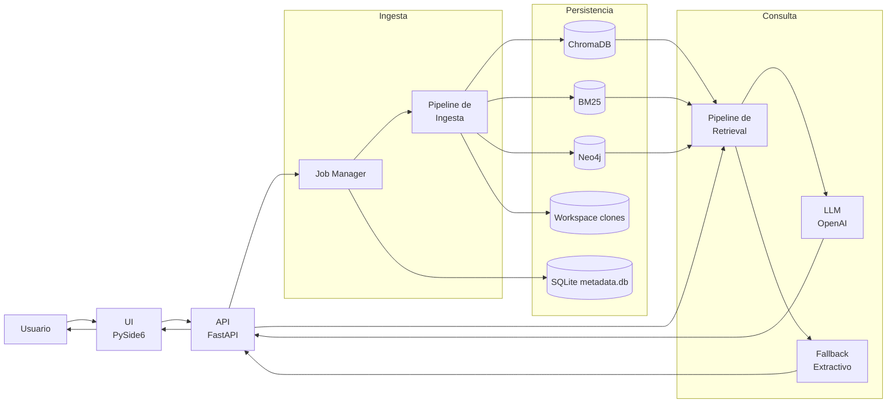
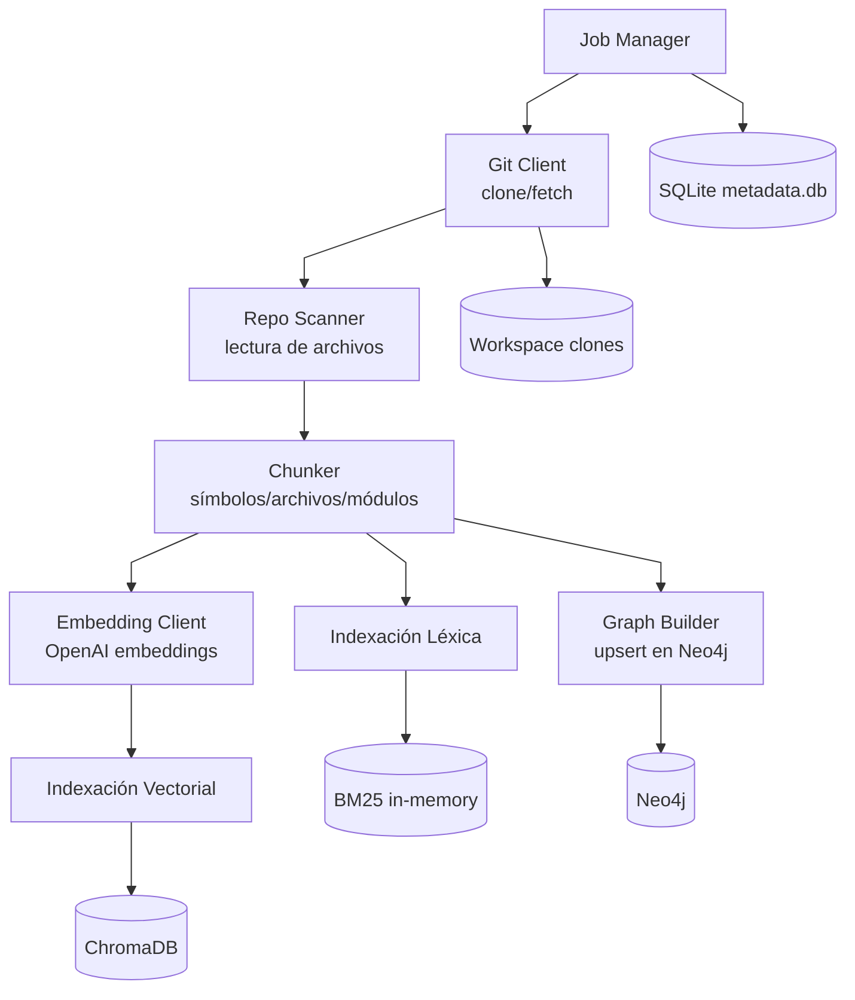
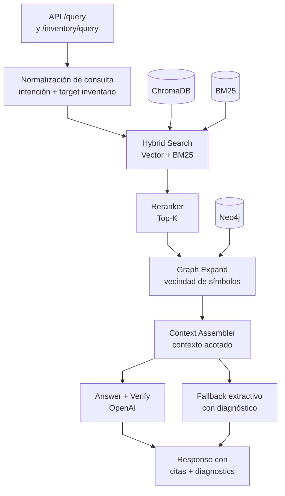

# RAG Hybrid Response Validator

RAG Hybrid Response Validator es una solución de análisis de repositorios basada en Hybrid RAG
(Vector + BM25 + Grafo) para responder preguntas sobre código con evidencia
verificable (archivos y líneas).

## Tabla de Contenidos

- [Descripción General](#descripción-general)
- [Características Principales](#características-principales)
- [Arquitectura del Sistema](#arquitectura-del-sistema)
- [Instalación](#instalación)
- [Configuración](#configuración)
- [Ejemplos de Uso](#ejemplos-de-uso)
- [Referencia de Servicios API](#referencia-de-servicios-api)
- [Estructura del Proyecto](#estructura-del-proyecto)
- [Testing](#testing)
- [Benchmark de Latencia](#benchmark-de-latencia)
- [QA Manual (UI)](#qa-manual-ui)
- [Notas de Versión](#notas-de-versión)
- [Troubleshooting](#troubleshooting)

## Descripción General

El sistema permite:

1. Ingestar repositorios Git (GitHub/Bitbucket).
2. Construir índices híbridos para búsqueda semántica y exacta.
3. Construir y consultar un grafo de conocimiento del código.
4. Responder consultas en lenguaje natural con citas verificables.

Se incluye API (FastAPI), UI de escritorio (PySide6), almacenamiento vectorial
(ChromaDB), índice lexical (BM25) y base de grafo (Neo4j).

## Características Principales

- Ingesta asíncrona por job con tracking de estado y logs.
- Indexación híbrida: símbolos, archivos y módulos.
- Recuperación robusta multi-stack con inventario estructural por grafo para
   consultas tipo “todos los X”.
- Inventario con expansión léxica genérica (singular/plural y equivalentes
   multi-idioma como `service/servicio`) para mejorar recall.
- Soporte de expansión GraphRAG para enriquecer contexto.
- Respuestas con citas y diagnósticos (`retrieved`, `reranked`, `graph_nodes`,
   etc.).
- Diagnóstico explícito de fallback (`fallback_reason`, `verify_valid`,
   `llm_error`) para diferenciar configuración, verificación y errores de
   generación.
- Fallback seguro cuando no hay configuración de LLM.

## Arquitectura del Sistema

### Componentes

- UI: PySide6 (`ingesta`, `consulta`, `evidencias`).
- API: FastAPI (`/repos/ingest`, `/jobs/{id}`, `/query`, `/repos`, `/admin/reset`).
- Ingesta: clonación, escaneo, chunking, embeddings, BM25, grafo.
- Retrieval: fusión vectorial + BM25 + expansión de grafo + ensamblado de
   contexto.
- LLM: OpenAI para respuesta y verificación anti-alucinación.

### Diagramas (Mermaid)

#### 1) Vista general



#### 2) Pipeline de ingesta (detalle)



#### 3) Pipeline de retrieval + respuesta (detalle)



### Relaciones clave

- **UI (PySide6)** consume la **API (FastAPI)** para ingesta, polling de jobs y consultas.
- **Ingesta** construye tres vistas complementarias del código: vectorial (**Chroma**), léxica (**BM25**) y relacional (**Neo4j**).
- **Retrieval híbrido** combina esas fuentes, rerankea, expande grafo y arma contexto antes de responder.
- **LLM** genera y verifica; si falla configuración/verificación/generación, entra **fallback extractivo** con citas y `diagnostics`.
- **SQLite + workspace** guardan estado operativo (jobs, repos y clones locales).

## Instalación

### Requisitos

- Python 3.10+
- Git
- Docker (recomendado para Neo4j)

### Pasos

1. Instalar dependencias:

    ```bash
    pip install -r requirements.txt
    ```

2. Crear archivo de entorno:

    ```bash
    copy .env.example .env
    ```

3. Levantar servicios auxiliares:

    ```bash
    docker compose up -d
    ```

> Redis no es requerido en la implementación actual. Se considera opcional/futuro
> para escenarios de escalado de jobs con colas distribuidas.

## Configuración

Variables relevantes en `.env`:

- `OPENAI_API_KEY`: clave API de OpenAI.
- `OPENAI_EMBEDDING_MODEL`, `OPENAI_ANSWER_MODEL`, `OPENAI_VERIFIER_MODEL`.
- `OPENAI_VERIFY_ENABLED`: habilita/deshabilita la etapa de verificación LLM posterior a la respuesta.
- `CHROMA_PATH`: ruta persistente de Chroma.
- `NEO4J_URI`, `NEO4J_USER`, `NEO4J_PASSWORD`.
- `REDIS_URL` (opcional/futuro): endpoint para cola de jobs distribuida.
- `WORKSPACE_PATH`: ruta de repos clonados.
- `MAX_CONTEXT_TOKENS`, `GRAPH_HOPS`.
- `QUERY_MAX_SECONDS`: presupuesto total por consulta en API.
- `OPENAI_TIMEOUT_SECONDS`: timeout máximo por llamada OpenAI (answer/verify).
- `UI_REQUEST_TIMEOUT_SECONDS`: timeout HTTP de la UI hacia API.
- `INVENTORY_PAGE_SIZE`, `INVENTORY_MAX_PAGE_SIZE`: paginación para inventario.
- `INVENTORY_ALIAS_LIMIT`, `INVENTORY_ENTITY_LIMIT`: límites de expansión de inventario.
- `SCAN_MAX_FILE_SIZE_BYTES` (obligatoria): tamaño máximo por archivo durante escaneo de ingesta.
- `SCAN_EXCLUDED_DIRS` (obligatoria): carpetas excluidas de la ingesta (CSV).
- `SCAN_EXCLUDED_EXTENSIONS` (obligatoria): extensiones excluidas de la ingesta (CSV).
- `SCAN_EXCLUDED_FILES` (opcional): nombres o rutas relativas de archivos a excluir (CSV).

### Filtros de escaneo de ingesta (obligatorios)

Desde esta versión, la ingesta no usa valores por defecto en código para filtros de escaneo.
Debes definir explícitamente estas variables en `.env`:

```dotenv
SCAN_MAX_FILE_SIZE_BYTES=200000
SCAN_EXCLUDED_DIRS=.git,node_modules,dist,build,venv,.venv,__pycache__,.idea,.vscode,target,out,bin,obj,.gradle,.m2,.pytest_cache,.mypy_cache
SCAN_EXCLUDED_EXTENSIONS=.png,.jpg,.jpeg,.gif,.webp,.ico,.mp3,.mp4,.wav,.ogg,.pdf,.zip,.tar,.gz,.7z,.rar,.jar,.war,.ear,.class,.dll,.exe,.so,.dylib,.o,.a,.bin,.sqlite,.db
SCAN_EXCLUDED_FILES=.gitignore,.env
```

Si falta alguna, la ingesta falla al iniciar con error de configuración.

> Nota: en esta configuración se recomienda `NEO4J_URI=bolt://127.0.0.1:17687`
para evitar conflictos de puertos locales comunes.

## Ejemplos de Uso

### 1) Ejecutar API

```bash
uvicorn coderag.api.server:app --reload
```

### 2) Ejecutar UI

```bash
python -m coderag.ui.main_window
```

### 3) Ingestar repositorio (PowerShell)

```powershell
$body = @{
   provider = 'github'
   repo_url = 'https://github.com/macrozheng/mall.git'
   branch = 'main'
} | ConvertTo-Json

Invoke-RestMethod -Method Post -Uri http://127.0.0.1:8000/repos/ingest -ContentType 'application/json' -Body $body
```

### 4) Consultar

```powershell
$q = @{
   repo_id = 'mall'
   query = 'cuales son todos los controller del modulo mall-admin?'
   top_n = 80
   top_k = 20

} | ConvertTo-Json

Invoke-RestMethod -Method Post -Uri http://127.0.0.1:8000/query -ContentType 'application/json' -Body $q
```

El `diagnostics` de la respuesta incluye, entre otros:

- `retrieved`, `reranked`, `graph_nodes`.
- `inventory_target`, `inventory_terms`, `inventory_count`.
- `fallback_reason`: `not_configured`, `verification_failed` o `generation_error`.
- `verify_valid`: resultado de verificación cuando OpenAI está habilitado.
- `llm_error`: detalle de excepción (solo si hubo error de generación/verificación).

### 5) Listar repos disponibles para consulta

```powershell
Invoke-RestMethod -Method Get -Uri http://127.0.0.1:8000/repos
```

Usa este endpoint para poblar/validar el selector de `repo_id` en la UI.

### 6) Consulta de inventario paginada (graph-first)

Para consultas amplias tipo “todos los X”, usa la ruta estructural dedicada:

```powershell
$inv = @{
   repo_id = 'mall'
   query = 'cuales son todos los modelos de mall-mbg'
   page = 1
   page_size = 50
} | ConvertTo-Json

Invoke-RestMethod -Method Post -Uri http://127.0.0.1:8000/inventory/query -ContentType 'application/json' -Body $inv
```

Esta ruta evita la carga completa del pipeline híbrido y devuelve resultados paginados
con `total`, `page`, `page_size`, `items`, `citations` y `diagnostics`.

### 7) Limpieza total (reset)

```powershell
Invoke-RestMethod -Method Post -Uri http://127.0.0.1:8000/admin/reset
```

Este endpoint elimina índices vectoriales, BM25 en memoria, grafo Neo4j,
metadata de jobs y carpetas de workspace para comenzar una ingesta desde cero.

## Referencia de Servicios API

### Base URL y OpenAPI

- Base URL local por defecto: `http://127.0.0.1:8000`.
- OpenAPI JSON: `GET /openapi.json`.
- Swagger UI: `GET /docs`.
- ReDoc: `GET /redoc`.

### Resumen de endpoints

| Método | Ruta | Propósito | Request | Response | Códigos comunes |
|---|---|---|---|---|---|
| POST | `/repos/ingest` | Crear trabajo de ingesta asíncrona | `RepoIngestRequest` | `JobInfo` | `200`, `422` |
| GET | `/jobs/{job_id}` | Consultar estado de un trabajo | Path `job_id` | `JobInfo` | `200`, `404` |
| POST | `/query` | Consulta híbrida general (vector + BM25 + grafo) | `QueryRequest` | `QueryResponse` | `200`, `422` |
| POST | `/inventory/query` | Consulta de inventario paginada (graph-first) | `InventoryQueryRequest` | `InventoryQueryResponse` | `200`, `422` |
| GET | `/repos` | Listar `repo_id` disponibles | N/A | `RepoCatalogResponse` | `200` |
| POST | `/admin/reset` | Limpieza total de índices/metadata/workspace | N/A | `ResetResponse` | `200`, `409`, `500` |

### Contratos de datos

#### 1) `RepoIngestRequest`

```json
{
   "provider": "github",
   "repo_url": "https://github.com/owner/repo.git",
   "token": "<opcional>",
   "branch": "main",
   "commit": "<opcional>"
}
```

Campos:

- `provider` (`str`, default `github`): proveedor Git.
- `repo_url` (`str`, requerido): URL del repositorio.
- `token` (`str | null`, opcional): token para repos privados.
- `branch` (`str`, default `main`): rama objetivo.
- `commit` (`str | null`, opcional): commit puntual.

#### 2) `JobInfo`

```json
{
   "id": "uuid",
   "status": "queued",
   "progress": 0.0,
   "logs": [],
   "repo_id": null,
   "error": null,
   "created_at": "2026-03-11T12:00:00.000000",
   "updated_at": "2026-03-11T12:00:00.000000"
}
```

`status` admite: `queued`, `running`, `completed`, `failed`.

#### 3) `QueryRequest`

```json
{
   "repo_id": "mall",
   "query": "cuales son todos los controller del modulo mall-admin?",
   "top_n": 80,
   "top_k": 20
}
```

Campos:

- `repo_id` (`str`, requerido): identificador del repositorio indexado.
- `query` (`str`, requerido): pregunta de negocio/técnica.
- `top_n` (`int`, default `80`): candidatos recuperados.
- `top_k` (`int`, default `20`): candidatos tras reranking.

#### 4) `QueryResponse`

```json
{
   "answer": "...",
   "citations": [
      {
         "path": "mall-admin/src/main/java/.../AdminController.java",
         "start_line": 42,
         "end_line": 88,
         "score": 0.91,
         "reason": "hybrid_rag_match"
      }
   ],
   "diagnostics": {
      "retrieved": 80,
      "reranked": 20,
      "graph_nodes": 12,
      "openai_enabled": true
   }
}
```

#### 5) `InventoryQueryRequest`

```json
{
   "repo_id": "mall",
   "query": "cuales son todos los modelos de mall-mbg",
   "page": 1,
   "page_size": 50
}
```

Campos:

- `repo_id` (`str`, requerido): identificador del repositorio indexado.
- `query` (`str`, requerido): consulta de inventario (ej. "todos los X").
- `page` (`int`, default `1`): página actual.
- `page_size` (`int`, default `80`): tamaño de página.

#### 6) `InventoryQueryResponse`

```json
{
   "answer": "Se encontraron 120 elementos.",
   "target": "model",
   "module_name": "mall-mbg",
   "total": 120,
   "page": 1,
   "page_size": 50,
   "items": [
      {
         "label": "PmsBrand",
         "path": "mall-mbg/src/main/java/.../PmsBrand.java",
         "kind": "class",
         "start_line": 1,
         "end_line": 120
      }
   ],
   "citations": [],
   "diagnostics": {
      "inventory_target": "model",
      "inventory_count": 120
   }
}
```

#### 7) `RepoCatalogResponse` y `ResetResponse`

`RepoCatalogResponse`:

```json
{
   "repo_ids": ["mall", "otro-repo"]
}
```

`ResetResponse`:

```json
{
   "message": "Limpieza total completada",
   "cleared": ["chroma", "bm25", "neo4j", "metadata", "workspace"],
   "warnings": []
}
```

### Referencia por endpoint

#### `POST /repos/ingest`

Uso: crear un job de ingesta en segundo plano.

Notas operativas:

- Devuelve `JobInfo` inmediatamente; la ingesta real corre en background.
- Polling recomendado: consultar `GET /jobs/{job_id}` cada 2-5 segundos.

Ejemplo cURL:

```bash
curl -X POST http://127.0.0.1:8000/repos/ingest \
   -H "Content-Type: application/json" \
   -d '{
      "provider": "github",
      "repo_url": "https://github.com/macrozheng/mall.git",
      "branch": "main"
   }'
```

Ejemplo Python:

```python
import requests

response = requests.post(
      "http://127.0.0.1:8000/repos/ingest",
      json={
            "provider": "github",
            "repo_url": "https://github.com/macrozheng/mall.git",
            "branch": "main",
      },
      timeout=30,
)
job = response.json()
print(job["id"], job["status"])
```

#### `GET /jobs/{job_id}`

Uso: consultar estado/progreso/logs de una ingesta.

Notas operativas:

- `404` si el `job_id` no existe.
- Al finalizar correctamente, `repo_id` queda disponible para consultas.

Ejemplo cURL:

```bash
curl http://127.0.0.1:8000/jobs/<job_id>
```

Ejemplo Python:

```python
import requests

job_id = "<job_id>"
response = requests.get(f"http://127.0.0.1:8000/jobs/{job_id}", timeout=15)
print(response.status_code, response.json())
```

#### `POST /query`

Uso: consulta híbrida general con evidencias.

Notas operativas:

- Si detecta intención de inventario amplia ("todos los X"), puede redirigir internamente a flujo de inventario estructurado.
- Siempre devuelve `answer`, `citations` y `diagnostics`.
- Puede devolver fallback extractivo cuando no hay LLM o falla verificación/generación.

Ejemplo cURL:

```bash
curl -X POST http://127.0.0.1:8000/query \
   -H "Content-Type: application/json" \
   -d '{
      "repo_id": "mall",
      "query": "cuales son todos los controller del modulo mall-admin?",
      "top_n": 80,
      "top_k": 20
   }'
```

Ejemplo Python:

```python
import requests

response = requests.post(
      "http://127.0.0.1:8000/query",
      json={
            "repo_id": "mall",
            "query": "cuales son todos los controller del modulo mall-admin?",
            "top_n": 80,
            "top_k": 20,
      },
      timeout=120,
)
data = response.json()
print(data["answer"])
print(data["diagnostics"])
```

#### `POST /inventory/query`

Uso: inventario paginado de entidades (graph-first).

Notas operativas:

- Recomendado para preguntas enumerativas grandes.
- Respuesta estructurada con `total`, `page`, `page_size`, `items`.

Ejemplo cURL:

```bash
curl -X POST http://127.0.0.1:8000/inventory/query \
   -H "Content-Type: application/json" \
   -d '{
      "repo_id": "mall",
      "query": "cuales son todos los modelos de mall-mbg",
      "page": 1,
      "page_size": 50
   }'
```

Ejemplo Python:

```python
import requests

response = requests.post(
      "http://127.0.0.1:8000/inventory/query",
      json={
            "repo_id": "mall",
            "query": "cuales son todos los modelos de mall-mbg",
            "page": 1,
            "page_size": 50,
      },
      timeout=60,
)
data = response.json()
print(data["total"], data["page"], data["page_size"])
print(data["items"][:3])
```

#### `GET /repos`

Uso: obtener catálogo de repositorios disponibles para `repo_id`.

Ejemplo cURL:

```bash
curl http://127.0.0.1:8000/repos
```

Ejemplo Python:

```python
import requests

response = requests.get("http://127.0.0.1:8000/repos", timeout=15)
print(response.json()["repo_ids"])
```

#### `POST /admin/reset`

Uso: limpiar estado completo (índices + metadatos + workspace).

Notas operativas:

- Si hay jobs corriendo, responde `409`.
- Usar cuando se requiera reinicio limpio de la plataforma.

Ejemplo cURL:

```bash
curl -X POST http://127.0.0.1:8000/admin/reset
```

Ejemplo Python:

```python
import requests

response = requests.post("http://127.0.0.1:8000/admin/reset", timeout=60)
print(response.status_code, response.json())
```

### Errores y validación

Errores más relevantes por contrato:

| Código | Endpoint típico | Motivo |
|---|---|---|
| `404` | `GET /jobs/{job_id}` | `job_id` inexistente |
| `409` | `POST /admin/reset` | hay jobs en ejecución |
| `422` | endpoints con body | validación Pydantic (campo faltante/tipo inválido) |
| `500` | `POST /admin/reset` | error inesperado en limpieza |

Ejemplo de error `404`:

```json
{
   "detail": "Job no encontrado"
}
```

Ejemplo de error `422`:

```json
{
   "detail": [
      {
         "loc": ["body", "repo_id"],
         "msg": "Field required",
         "type": "missing"
      }
   ]
}
```

### Guía de `diagnostics`

Campos frecuentes en respuestas de `POST /query`:

- `retrieved`: total de candidatos recuperados.
- `reranked`: total tras reranking.
- `graph_nodes`: nodos añadidos por expansión de grafo.
- `openai_enabled`: si LLM está disponible.
- `fallback_reason`: razón de fallback (`not_configured`, `verification_failed`, `generation_error`, `time_budget_exhausted`).
- `verify_valid`: resultado del verificador cuando aplica.
- `verify_skipped`: indica si se omitió verificación por presupuesto.
- `llm_error`: detalle de excepción LLM cuando existe.
- `stage_timings_ms`: latencia por etapa.

Campos frecuentes en `POST /inventory/query`:

- `inventory_target`: entidad objetivo normalizada.
- `inventory_terms`: términos/aliases usados para búsqueda.
- `inventory_count`: total detectado previo a paginación.
- `module_name_raw`: módulo recibido en lenguaje natural.
- `module_name_resolved`: módulo resuelto para consulta.
- `inventory_explain`: si se pidió explicación de propósito.
- `inventory_purpose_count`: cantidad de descripciones generadas.
- `fallback_reason`: razón de fallback estructurado.

Interpretación recomendada:

- Si `fallback_reason` existe, revisar primero `openai_enabled`, `verify_valid` y `llm_error`.
- Si una respuesta enumerativa parece incompleta, validar `inventory_count`, `page` y `page_size`.
- Para performance, inspeccionar `stage_timings_ms` y comparar etapas dominantes.

## Estructura del Proyecto

```text
coderag/
├── api/            # FastAPI, orquestación de query
├── core/           # settings, modelos, logging
├── ingestion/      # git, scanner, chunker, embedding, índices, grafo
├── jobs/           # job manager
├── llm/            # cliente OpenAI y prompts
├── parsers/        # parseadores por lenguaje
├── retrieval/      # búsqueda híbrida, reranking, context assembly
├── storage/        # metadata store
└── ui/             # aplicación PySide6
tests/              # pruebas unitarias
```

## Testing

Ejecutar pruebas:

```bash
pytest -q
```

Cobertura validada en la implementación actual:

- Ingesta y recuperación.
- Parsing de símbolos.
- Manejo de límites de batch/embeddings.
- Detección de inventarios estructurados.

## Benchmark de Latencia

Se incluye benchmark live para medir p50/p95/p99 sobre endpoints reales de API.

1. Levantar API y asegurar que el repositorio ya esté ingerido.
2. Ejecutar benchmark:

```powershell
python scripts/benchmark_api_live.py --repo-id mall --base-url http://127.0.0.1:8000 --iterations 20 --warmup 2
```

3. Revisar artefactos en `benchmark_reports/`:
- `benchmark_live_YYYYMMDD_HHMMSS.json`
- `benchmark_live_YYYYMMDD_HHMMSS.csv`

El reporte CSV contiene métricas agregadas por escenario (`query_general`,
`query_module`, `inventory_query`, `inventory_explain`) y medias de etapas
diagnósticas cuando están disponibles (`hybrid_search_ms`, `graph_expand_ms`,
`context_assembly_ms`, etc.).

## QA Manual (UI)

Checklist sugerida antes de release (3 escenarios):

1. **Ingesta exitosa**
   - Abrir la pestaña **Ingesta** y completar `provider`, `repo_url`, `branch`.
   - Ejecutar **Ingestar** y verificar transición de estado: `Idle` → `En progreso` → `Completado`.
   - Confirmar que `Job ID`, `Repo ID`, barra de progreso y logs se actualizan.

2. **Consulta válida**
   - Ir a **Consulta** con un `Repo ID` existente y una pregunta no vacía.
   - Verificar estado de consulta: `Lista` → `Consultando` → `Completado`.
   - Confirmar que se muestra respuesta y que la tabla **Evidencia** contiene filas.

3. **Errores de validación y API**
   - Ejecutar consulta sin `Repo ID` o sin pregunta y validar mensaje claro en UI.
   - Con API detenida, lanzar consulta y confirmar estado `Error` con detalle legible.
   - Verificar que el botón vuelve a estado habilitado al finalizar.

## Notas de Versión

### v1.0.0-ui-polish

- Rediseño visual de la pestaña **Ingesta** con estado, progreso y campos de job.
- Polling de jobs en UI para reflejar estado real de ingesta en tiempo real.
- Rediseño de **Consulta** y **Evidencia** con tema unificado y mejor legibilidad.
- Validaciones y feedback de error mejorados para consultas en UI.
- Checklist de QA manual para validación pre-release.

## Troubleshooting

- **`OPENAI no configurado`**
   - Verifica que la clave esté en `.env` (no en `.env.example`).
   - Reinicia la API después de cambios en entorno.

- **Fallback por verificación (`fallback_reason=verification_failed`)**
    - No implica falta de configuración; indica que la respuesta generada no
       pasó validación de grounding.
    - Revisa `diagnostics.verify_valid`, `diagnostics.fallback_reason` y
       `diagnostics.inventory_count` para distinguir entre falta de evidencia vs
       rechazo del verificador.

- **Neo4j `Unauthorized` o `connection` error**
   - Valida `NEO4J_URI`, usuario y contraseña.
   - Verifica que el contenedor esté arriba y escuchando en el puerto esperado.

- **Ingesta tarda mucho en `Generando embeddings`**
   - Es normal en repositorios grandes.
   - Revisa logs del job en `GET /jobs/{id}`.

- **Respuestas incompletas en consultas enumerativas**
   - Usa consultas explícitas tipo “todos los X del módulo Y”.
    - El extractor de módulo reconoce patrones como `módulo Y`, `in Y`, `de Y`,
       `del Y`, `of Y` y tokens tipo `foo-bar`.
   - Revisa `diagnostics.inventory_count` y `diagnostics.graph_nodes`.
    - Revisa `diagnostics.inventory_terms` para confirmar las variantes
       aplicadas en la búsqueda de inventario.

- **Conflictos de puertos Docker**
   - Ajusta puertos host en `docker-compose.yml`.
   - Actualiza `NEO4J_URI` en `.env` acorde al puerto bolt configurado.
