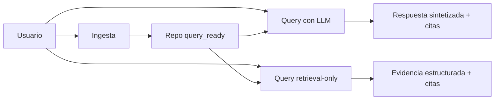

# RAG Hybrid Response Validator

Plataforma de analisis de repositorios con Hybrid RAG para responder preguntas
de codigo con evidencia verificable (archivos y lineas).

## Que hace

- Ingesta repositorios Git en segundo plano con seguimiento por job.
- Construye indices complementarios: vectorial remoto, store lexico en
  Postgres y grafo en Neo4j.
- Permite habilitar grafo semantico Python (CALLS, IMPORTS, EXTENDS) con
  flag de entorno y fallback seguro.
- Permite habilitar grafo semantico Java fase 1 (IMPORTS,
  EXTENDS/IMPLEMENTS, CALLS basicos) con flag dedicado.
- Permite habilitar grafo semantico JavaScript fase 1 (IMPORTS,
  EXTENDS/IMPLEMENTS, CALLS basicos) con flag dedicado.
- Permite habilitar grafo semantico TypeScript fase 1 (IMPORTS,
  EXTENDS/IMPLEMENTS, CALLS basicos) con flag dedicado.
- Permite habilitar expansion semantica en query con filtros por tipo de
  relacion y budgets de nodos/aristas/latencia.
- Responde consultas por dos rutas:
  - Query con LLM y verificacion.
  - Retrieval-only sin sintesis LLM.
- Devuelve citas y diagnosticos para trazabilidad de resultados.

## Requisitos

- Python 3.12+ recomendado (compatibilidad verificada con 3.12.3)
- Git
- Rancher Desktop con nerdctl compose o Docker Desktop con docker compose
- kubectl y Kustomize (opcional para despliegue en Kubernetes)

Nota Windows: si `pip install -r requirements.txt` falla al compilar
`chroma-hnswlib`, instala Visual Studio 2022 Build Tools con workload C++
(`Microsoft.VisualStudio.Workload.VCTools`).

## Quick Start

1. Instala dependencias y crea entorno.

```powershell
py -3.12 -m venv .venv
.\.venv\Scripts\python -m pip install --upgrade pip
.\.venv\Scripts\python -m pip install -r requirements.txt
copy .env.example .env
```

Perfiles de dependencias:

- `requirements.txt`: baseline API/worker para levantar el backend.
- `requirements-runtime.txt`: alias explicito del perfil API/worker.
- `requirements-desktop.txt`: runtime + UI de escritorio.
- `requirements-full.txt`: entorno completo local con UI y tests.

Variables mínimas en `.env` para Vertex:

```dotenv
LLM_PROVIDER=vertex
EMBEDDING_PROVIDER=vertex
VERTEX_AI_AUTH_MODE=service_account
VERTEX_SERVICE_ACCOUNT_JSON_B64=<base64_json_sa>
VERTEX_API_BASE_URL=https://us-central1-aiplatform.googleapis.com
CHROMA_MODE=remote
CHROMA_HOST=<chroma-host>
CHROMA_PORT=8000
CHROMA_ADMIN_API_ENABLED=false
# Opcional cuando actives endpoints admin de Chroma
# CHROMA_ADMIN_API_TOKEN=<token-admin-chroma>
# Opcion A: bearer token
CHROMA_TOKEN=<chroma-bearer-token>
# Opcion B: Basic auth (mutuamente excluyente con CHROMA_TOKEN)
# CHROMA_USERNAME=<chroma-username>
# CHROMA_PASSWORD=<chroma-password>
POSTGRES_HOST=<postgres-host>
POSTGRES_PORT=5432
POSTGRES_DB=<postgres-db>
POSTGRES_USER=<postgres-user>
POSTGRES_PASSWORD=<postgres-password>
RUNTIME_ENVIRONMENT=development
```

Con `RUNTIME_ENVIRONMENT=development` o `test`, la API y el worker aplican
automaticamente `alembic upgrade head` al iniciar, y si detectan un esquema
legacy compatible sin versionado lo estampan en `head`. Con
`RUNTIME_ENVIRONMENT=production`, el proceso no modifica la base: solo valida
que la revision actual ya este alineada con Alembic y falla si no lo esta.

Para operar Alembic manualmente con la misma resolucion de `POSTGRES_*` del
runtime, usa el helper del repo:

```powershell
.\.venv\Scripts\python scripts/postgres_schema_admin.py validate
.\.venv\Scripts\python scripts/postgres_schema_admin.py current
.\.venv\Scripts\python scripts/postgres_schema_admin.py upgrade head
```

Si vienes del esquema PostgreSQL legacy con tablas `jobs`, `repos` y
`lexical_corpus`, puedes copiar esos datos al esquema actual versionado antes
de apagar el camino viejo:

```powershell
.\.venv\Scripts\python scripts/migrate_legacy_postgres_to_alembic.py
```

El flujo crea o alinea primero las tablas `tbl_repository_*` con Alembic y
luego migra metadata y corpus lexico con upsert idempotente, dejando intactas
las tablas source para validacion o rollback manual.

Para una ventana de cutover completa sobre una base representativa o real, usa
el runner operativo:

```powershell
.\.venv\Scripts\python scripts/run_postgres_legacy_cutover.py --output-dir migration_reports --report-prefix prod_cutover_candidate --health-url http://127.0.0.1:8000/health
```

Ese runner ejecuta `current`, migracion legacy, `validate` y exporta evidencia
JSON + checklist Markdown para revision operativa.

Si quieres cerrar tambien los checks manuales en el mismo artefacto, agrega
`--confirm-backup`, `--confirm-rollback` y `--confirm-retain-legacy`.

El siguiente bloque de retiro legacy ya queda preparado: con Postgres activo,
la ingesta ya no usa BM25 ni SQLite como backends soportados y el tooling
operativo tampoco limpia snapshots BM25 ni `metadata.db`. Cualquier rollback
posterior al cutover requiere un despliegue controlado de una version previa o
un procedimiento tecnico separado. La politica completa de salida y rollback
esta en
[docs/migration-guides/legacy-storage-retirement.md](docs/migration-guides/legacy-storage-retirement.md).

Para metadata, PostgreSQL es obligatorio en el runtime actual; si no hay
`POSTGRES_*`, el servicio reporta storage no disponible en vez de volver a
SQLite.

El reporte de salida incluye una auditoria por tabla legacy con:
`source_count`, `target_count_before`, `target_count_after`, `matched_after` y
`missing_after`. Para un cutover seguro, el criterio minimo es
`matched_after == source_count` y `missing_after == 0` en `jobs`, `repos` y
`lexical_corpus`.

Si el bootstrap detecta tablas legacy parciales o con columnas faltantes, no
las estampa automaticamente: el proceso falla y exige una migracion manual o la
recreacion del esquema.

`project_id` se deriva del JSON Base64 del service account y `location` se deriva
del host configurado en `VERTEX_API_BASE_URL`. `VERTEX_AI_PROJECT_ID` y
`VERTEX_AI_LOCATION` quedan solo como fallback legacy.

Para Chroma remoto, el runtime soporta `CHROMA_TOKEN` o `CHROMA_USERNAME` +
`CHROMA_PASSWORD`, pero no ambos mecanismos a la vez.

1. Levanta stack local simplificado con Docker Compose.

```powershell
./scripts/start_compose.ps1
```

Opcional con Redis:

```powershell
./scripts/start_compose.ps1 -WithRedis
```

Para ingesta asíncrona distribuida (API encola + worker procesa):

```powershell
$env:INGESTION_EXECUTION_MODE = 'rq'
./scripts/start_compose.ps1 -WithRedis
```

Notas operativas del arranque local:

- `start_compose.ps1` levanta por defecto `api + neo4j + chroma + postgres`.
- Con `-WithRedis`, agrega `redis + worker` para ejecucion distribuida.
- El helper activa el perfil `remote` y espera `GET /health`, no solo la
  apertura del puerto 8000.
- Dentro de Compose, API y worker resuelven `postgres`, `chroma`, `neo4j` y
  `redis` por DNS interno. Usa `localhost` solo cuando la API corra fuera de
  contenedor contra servicios expuestos en la maquina host.

Alternativa para desarrollo local (API/UI fuera de contenedor):

```powershell
./scripts/start_stable.ps1
```

Arranque directo de API (sin scripts):

```powershell
$env:PYTHONPATH = 'src'
.\.venv\Scripts\python -m main --host 127.0.0.1 --port 8000
```

1. Inicia una ingesta.

```powershell
$body = @{
  provider = 'github'
  repo_url = 'https://github.com/macrozheng/mall.git'
  branch = 'main'
} | ConvertTo-Json

Invoke-RestMethod -Method Post -Uri http://127.0.0.1:8000/repos/ingest -ContentType 'application/json' -Body $body
```

Para repos privados en GitHub, usa URL HTTPS y envía `token` en el request de
ingesta.

Para repos privados en Bitbucket, ahora hay dos caminos soportados:

- SSH: usa URL SSH (por ejemplo `git@bitbucket.org:workspace/proyecto.git`)
  y resuelve autenticación en runtime vía `GIT_SSH_KEY_CONTENT(_B64)` y
  `GIT_SSH_KNOWN_HOSTS_CONTENT(_B64)`.
- HTTPS: usa URL HTTPS y envía un bloque `auth` con `deployment`,
  `transport=https`, `method=http_basic`, `username` y `secret`.

Ejemplo rápido para Bitbucket Cloud o Server/Data Center vía HTTPS:

```json
{
  "provider": "bitbucket",
  "repo_url": "https://bitbucket.org/workspace/proyecto.git",
  "branch": "main",
  "auth": {
    "deployment": "cloud",
    "transport": "https",
    "method": "http_basic",
    "username": "usuario",
    "secret": "app-password-o-pat"
  }
}
```

Ejemplo rapido para `.env` o Docker Compose:

```dotenv
GIT_SSH_KEY_CONTENT_B64=<base64_private_key_openssh>
GIT_SSH_KNOWN_HOSTS_CONTENT_B64=<base64_known_hosts>
GIT_SSH_STRICT_HOST_KEY_CHECKING=yes
```

1. Consulta estado del job.

```powershell
Invoke-RestMethod -Method Get -Uri "http://127.0.0.1:8000/jobs/<job_id>?logs_tail=200"
```

## Kubernetes (Cloud)

Despliegue base (API + Neo4j):

```powershell
kubectl apply -k k8s/overlays/cloud
```

Despliegue con Redis opcional:

```powershell
kubectl apply -k k8s/overlays/cloud-with-redis
```

Nota: actualiza la imagen en `k8s/overlays/cloud/patch-api-deployment.yaml`
con tu registry/tag antes de aplicar en entornos gestionados.

Nota operativa: en entornos cloud, valida ademas como se resolveran Chroma y
Postgres para la topologia remota recomendada del proyecto.

## Customer Journeys



| Journey | Entrada | Salida | Referencia |
| --- | --- | --- | --- |
| Ingesta | POST /repos/ingest | Job con estado y logs | [docs/ARCHITECTURE.md](docs/ARCHITECTURE.md) |
| Query con LLM | POST /query | Answer con citas + diagnostics | [docs/API_REFERENCE.md](docs/API_REFERENCE.md) |
| Query retrieval-only | POST /query/retrieval | Chunks + citations + stats | [docs/API_REFERENCE.md](docs/API_REFERENCE.md) |

## API Rapida

Rutas principales:

- POST /repos/ingest
- GET /jobs/{job_id}
- POST /query
- POST /query/retrieval
- POST /inventory/query
- GET /repos
- DELETE /repos/{repo_id}
- GET /repos/{repo_id}/status
- GET /providers/models
- GET /health
- GET /admin/chroma/diagnostics
- POST /admin/chroma/query
- POST /admin/reset

Referencia completa por journeys y contratos:

- [docs/API_REFERENCE.md](docs/API_REFERENCE.md)

## Errores HTTP frecuentes

Si recibes errores durante ingesta o consulta:

- Revisa guia de troubleshooting: [docs/TROUBLESHOOTING.md](docs/TROUBLESHOOTING.md)
- Revisa formas de error comunes: [docs/API_REFERENCE.md#formas-de-error-comunes](docs/API_REFERENCE.md#formas-de-error-comunes)

Atajo de diagnostico:

- Readiness por repo: GET /repos/{repo_id}/status
- Salud de storage: GET /health
- Diagnostico de colecciones Chroma: GET /admin/chroma/diagnostics
- Query directa controlada a Chroma: POST /admin/chroma/query

Nota de contrato: el endpoint de readiness expone `lexical_loaded` como señal
neutral de la capa léxica activa; `bm25_loaded` ya no forma parte del contrato.

Nota operativa: los endpoints de Chroma son de solo lectura y se pensaron para
soporte y pruebas. Aunque puedan quedar abiertos temporalmente en un entorno
controlado, no deben exponerse a internet sin autenticación o controles
adicionales.

Para habilitarlos explícitamente, activa `CHROMA_ADMIN_API_ENABLED=true`. Si
además defines `CHROMA_ADMIN_API_TOKEN`, debes enviar el header
`X-Chroma-Admin-Token` en cada request.

Ejemplo rapido para obtener vector store collection count:

```powershell
Invoke-RestMethod -Method Get -Uri "http://127.0.0.1:8000/admin/chroma/diagnostics?collection_names=code_symbols"
```

Ejemplo rapido para consulta directa controlada:

```powershell
$body = @{
  operation = 'collection_count'
  collection_name = 'code_symbols'
  where = @{ language = 'python' }
} | ConvertTo-Json

Invoke-RestMethod -Method Post -Uri http://127.0.0.1:8000/admin/chroma/query -ContentType 'application/json' -Headers @{ 'X-Chroma-Admin-Token' = '<token-opcional>' } -Body $body
```

## Comandos por Journey

Consulta con LLM:

```powershell
$q = @{
  repo_id = 'macrozheng-mall-main'
  query = 'cuales son los controller del modulo mall-admin'
  top_n = 60
  top_k = 15
} | ConvertTo-Json

Invoke-RestMethod -Method Post -Uri http://127.0.0.1:8000/query -ContentType 'application/json' -Body $q
```

Consulta retrieval-only:

```powershell
$r = @{
  repo_id = 'macrozheng-mall-main'
  query = 'donde esta la configuracion de neo4j'
  top_n = 60
  top_k = 15
  include_context = $false
} | ConvertTo-Json

Invoke-RestMethod -Method Post -Uri http://127.0.0.1:8000/query/retrieval -ContentType 'application/json' -Body $r
```

Eliminar repositorio indexado:

```powershell
Invoke-RestMethod -Method Delete -Uri http://127.0.0.1:8000/repos/macrozheng-mall-main
```

## Documentacion

- Instalacion: [docs/INSTALLATION.md](docs/INSTALLATION.md)
- Configuracion: [docs/CONFIGURATION.md](docs/CONFIGURATION.md)
- Arquitectura y secuencias Mermaid: [docs/ARCHITECTURE.md](docs/ARCHITECTURE.md)
- API detallada: [docs/API_REFERENCE.md](docs/API_REFERENCE.md)
- Troubleshooting: [docs/TROUBLESHOOTING.md](docs/TROUBLESHOOTING.md)
- Runbook rollout/rollback semántico: [docs/SEMANTIC_GRAPH_RUNBOOK.md](docs/SEMANTIC_GRAPH_RUNBOOK.md)
- Guía de despliegue Kubernetes: [k8s/README.md](k8s/README.md)
- Guia Kubernetes consolidada: [docs/KUBERNETES.md](docs/KUBERNETES.md)
- Benchmark Sprint 3: [docs/SPRINT3_BENCHMARK.md](docs/SPRINT3_BENCHMARK.md)
- Extractores de simbolos: [docs/SYMBOL_EXTRACTORS.md](docs/SYMBOL_EXTRACTORS.md)
- Guia de contribucion: [docs/CONTRIBUTING.md](docs/CONTRIBUTING.md)
- Migraciones: [docs/migration-guides/README.md](docs/migration-guides/README.md)
- Cutover Postgres legacy: [docs/migration-guides/postgres-legacy-cutover.md](docs/migration-guides/postgres-legacy-cutover.md)
- Historial de cambios: [CHANGELOG.md](CHANGELOG.md)

## Ejemplos Ejecutables

- Python: [examples/python/](examples/python/)
- Curl: [examples/curl/](examples/curl/)
- PowerShell: [examples/powershell/](examples/powershell/)

Resultado esperado de los ejemplos:

- Ingesta: obtienes job_id y estado final completed o partial.
- Query con LLM: obtienes answer, citations y diagnostics.
- Retrieval-only: obtienes chunks, citations y statistics sin sintesis LLM.

## Validacion de Documentacion

```powershell
.\.venv\Scripts\python scripts/docs/validate_docs.py
.\.venv\Scripts\python scripts/docs/validate_links.py
.\.venv\Scripts\python scripts/docs/validate_examples.py
```

## Benchmarking

```powershell
.\.venv\Scripts\python.exe scripts\benchmark_compare_pre_post.py ..\KDB-RAG-Repo-pre-s3
.\.venv\Scripts\python.exe scripts\benchmark_api_live.py --base-url http://127.0.0.1:8000 --repo-id kdb-rag-repo --iterations 20 --warmup 2 --top-n 60 --top-k 15
.\.venv\Scripts\python.exe scripts\benchmark_architecture_queries.py --base-url http://127.0.0.1:8000 --repo-id kdb-rag-repo --top-n 60 --top-k 15
.\.venv\Scripts\python.exe scripts\benchmark_architecture_quality.py --base-url http://127.0.0.1:8000 --repo-id kdb-rag-repo --top-n 60 --top-k 15
.\.venv\Scripts\python.exe scripts\benchmark_architecture_facts.py --base-url http://127.0.0.1:8000 --repo-id kdb-rag-repo --gold-file scripts/benchmark_data/architecture_facts_gold.json --top-n 60 --top-k 15
.\.venv\Scripts\python.exe scripts\benchmark_facts_gate.py --on-report benchmark_reports/architecture_facts_eval_20260324_223605.json --off-report benchmark_reports/architecture_facts_eval_20260324_224016.json --review-csv scripts/benchmark_data/architecture_facts_review_template.csv --min-uplift 0.15 --min-reviewed-ratio 0.90 --min-correct-ratio 0.85
.\.venv\Scripts\python.exe scripts\benchmark_rollback_simulation.py --repo-id kdb-rag-repo --host 127.0.0.1 --port 8013
```

## Testing

En Windows, usa el interprete del venv de forma explicita:

```powershell
.\.venv\Scripts\python -m pytest -q
```
