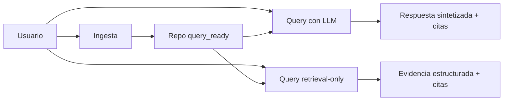

# RAG Hybrid Response Validator

Plataforma de analisis de repositorios con Hybrid RAG para responder preguntas
de codigo con evidencia verificable (archivos y lineas).

## Que hace

- Ingesta repositorios Git en segundo plano con seguimiento por job.
- Construye indices complementarios: vectorial, lexico y grafo.
- Responde consultas por dos rutas:
  - Query con LLM y verificacion.
  - Retrieval-only sin sintesis LLM.
- Devuelve citas y diagnosticos para trazabilidad de resultados.

## Quick Start

1. Instala dependencias y crea entorno.

```powershell
pip install -r requirements.txt
copy .env.example .env
```

2. Levanta Neo4j y API.

```powershell
./scripts/compose_neo4j.ps1 up
.\.venv\Scripts\python -m uvicorn coderag.api.server:app
```

3. Inicia una ingesta.

```powershell
$body = @{
  provider = 'github'
  repo_url = 'https://github.com/macrozheng/mall.git'
  branch = 'main'
} | ConvertTo-Json

Invoke-RestMethod -Method Post -Uri http://127.0.0.1:8000/repos/ingest -ContentType 'application/json' -Body $body
```

4. Consulta estado del job.

```powershell
Invoke-RestMethod -Method Get -Uri "http://127.0.0.1:8000/jobs/<job_id>?logs_tail=200"
```

## Customer Journeys



| Journey | Entrada | Salida | Referencia |
|---|---|---|---|
| Ingesta | POST /repos/ingest | Job con estado y logs | [docs/ARCHITECTURE.md](docs/ARCHITECTURE.md) |
| Query con LLM | POST /query | Answer con citas + diagnostics | [docs/API_REFERENCE.md](docs/API_REFERENCE.md) |
| Query retrieval-only | POST /query/retrieval | Chunks + citations + stats | [docs/API_REFERENCE.md](docs/API_REFERENCE.md) |

## API Rapida

Rutas principales:

- POST /repos/ingest
- GET /jobs/{job_id}
- POST /query
- POST /query/retrieval
- POST /inventory/query
- GET /repos
- DELETE /repos/{repo_id}
- GET /repos/{repo_id}/status
- GET /providers/models
- GET /health/storage
- POST /admin/reset

Referencia completa por journeys y contratos:

- [docs/API_REFERENCE.md](docs/API_REFERENCE.md)

## Errores HTTP frecuentes

Si recibes errores durante ingesta o consulta:

- Revisa guia de troubleshooting: [docs/TROUBLESHOOTING.md](docs/TROUBLESHOOTING.md)
- Revisa matriz de accion recomendada: [docs/API_REFERENCE.md#matriz-de-accion-recomendada](docs/API_REFERENCE.md#matriz-de-accion-recomendada)

Atajo de diagnostico:

- Readiness por repo: GET /repos/{repo_id}/status
- Salud de storage: GET /health/storage

## Comandos por Journey

Consulta con LLM:

```powershell
$q = @{
  repo_id = 'mall'
  query = 'cuales son los controller del modulo mall-admin'
  top_n = 60
  top_k = 15
} | ConvertTo-Json

Invoke-RestMethod -Method Post -Uri http://127.0.0.1:8000/query -ContentType 'application/json' -Body $q
```

Consulta retrieval-only:

```powershell
$r = @{
  repo_id = 'mall'
  query = 'donde esta la configuracion de neo4j'
  top_n = 60
  top_k = 15
  include_context = $false
} | ConvertTo-Json

Invoke-RestMethod -Method Post -Uri http://127.0.0.1:8000/query/retrieval -ContentType 'application/json' -Body $r
```

Eliminar repositorio indexado:

```powershell
Invoke-RestMethod -Method Delete -Uri http://127.0.0.1:8000/repos/mall
```

## Documentacion

- Instalacion: [docs/INSTALLATION.md](docs/INSTALLATION.md)
- Configuracion: [docs/CONFIGURATION.md](docs/CONFIGURATION.md)
- Arquitectura y secuencias Mermaid: [docs/ARCHITECTURE.md](docs/ARCHITECTURE.md)
- API detallada: [docs/API_REFERENCE.md](docs/API_REFERENCE.md)
- Troubleshooting: [docs/TROUBLESHOOTING.md](docs/TROUBLESHOOTING.md)
- Extractores de simbolos: [docs/SYMBOL_EXTRACTORS.md](docs/SYMBOL_EXTRACTORS.md)
- Guia de contribucion: [docs/CONTRIBUTING.md](docs/CONTRIBUTING.md)
- Migraciones: [docs/migration-guides/README.md](docs/migration-guides/README.md)
- Historial de cambios: [CHANGELOG.md](CHANGELOG.md)

## Ejemplos Ejecutables

- Python: [examples/python/](examples/python/)
- Curl: [examples/curl/](examples/curl/)
- PowerShell: [examples/powershell/](examples/powershell/)

Resultado esperado de los ejemplos:

- Ingesta: obtienes job_id y estado final completed o partial.
- Query con LLM: obtienes answer, citations y diagnostics.
- Retrieval-only: obtienes chunks, citations y statistics sin sintesis LLM.

## Validacion de Documentacion

```powershell
.\.venv\Scripts\python scripts/docs/validate_docs.py
.\.venv\Scripts\python scripts/docs/validate_links.py
.\.venv\Scripts\python scripts/docs/validate_examples.py
```

## Testing

En Windows, usa el interprete del venv de forma explicita:

```powershell
.\.venv\Scripts\python -m pytest -q
```
