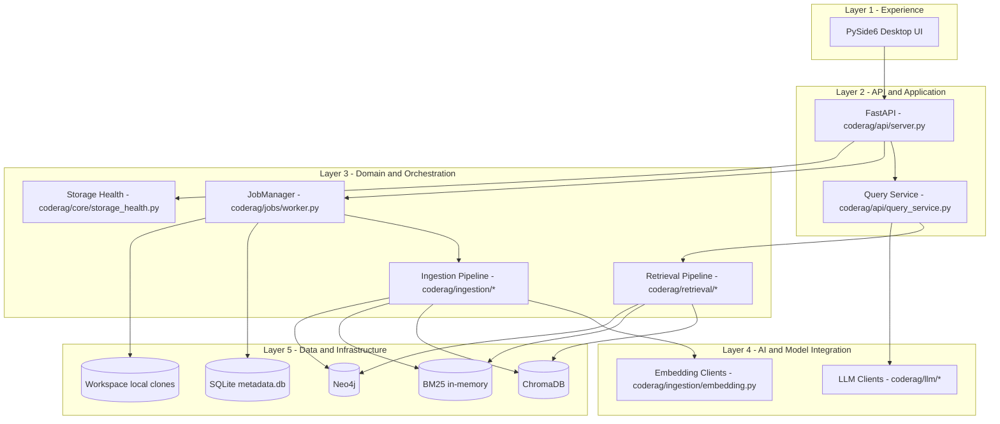
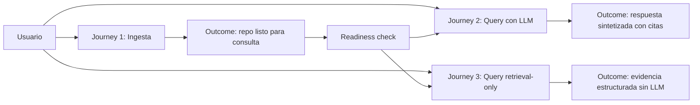
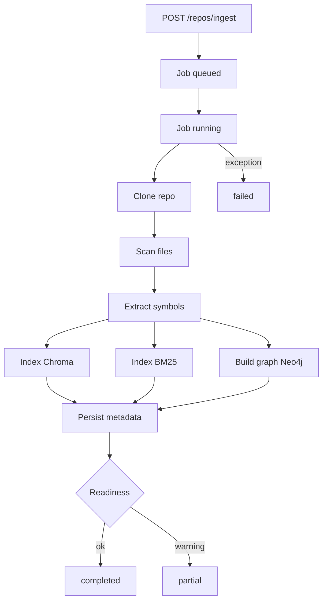
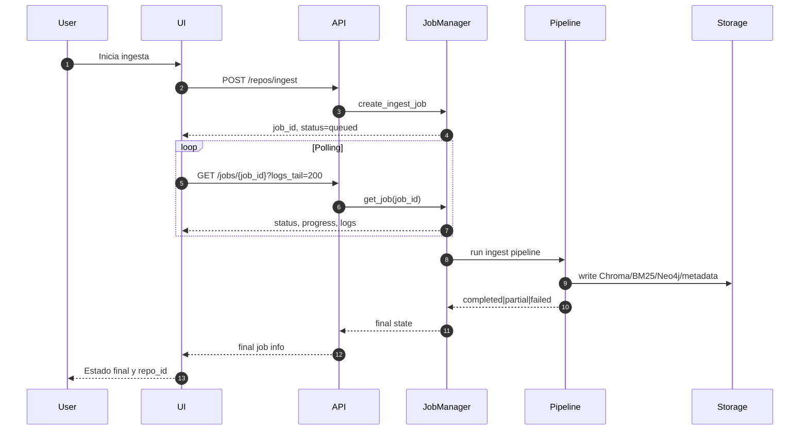
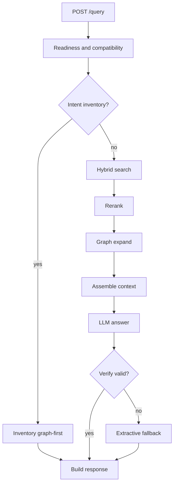
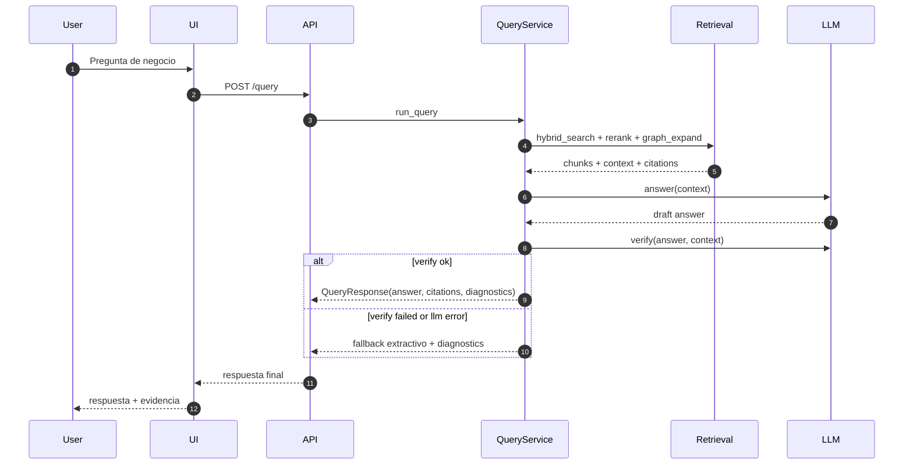
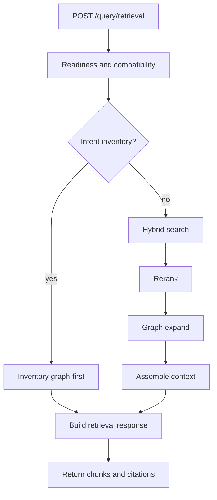
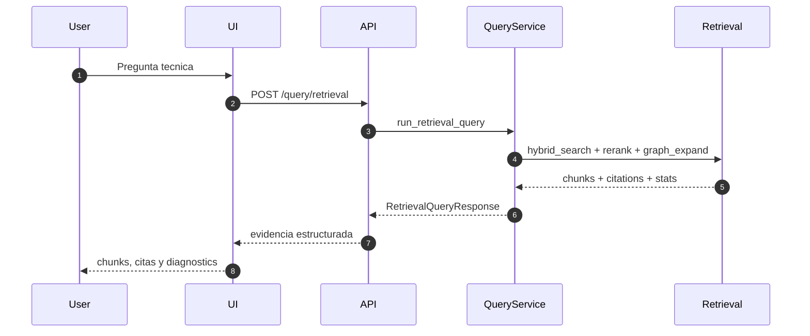

# Architecture and Customer Journeys

Documento de referencia para entender la interaccion entre usuario, UI,
API, pipeline de ingesta, retrieval y LLM.

## Reseña de Arquitectura

KDB-RAG-Repo implementa una arquitectura de tipo cliente-servidor orientada a
RAG hibrido para repositorios de codigo. El frontend de escritorio en PySide6
actua como punto de entrada para ingesta, consulta y exploracion de evidencia.
El backend expone una API FastAPI que orquesta jobs de ingesta, valida
precondiciones de storage y ejecuta rutas de consulta con o sin LLM.

La interaccion entre servicios se divide en dos grandes rutas: ingesta y query.
En ingesta, el JobManager coordina clonacion, escaneo, extraccion de simbolos,
indexacion vectorial en Chroma, indexacion lexical en BM25 y construccion de
grafo en Neo4j. En query, la API enruta consultas al pipeline de retrieval,
combina evidencia de Chroma/BM25/Neo4j, arma contexto y decide entre sintesis
LLM o salida retrieval-only segun endpoint y condiciones operativas.

## Descripción general del sistema

- Frontend: aplicacion PySide6 para UX operativa de ingesta y consultas.
- Backend: FastAPI para contratos HTTP y orquestacion de flujos.
- Capa de jobs: JobManager para ejecucion asincrona, estado y logs.
- Retrieval: busqueda hibrida, reranking, expansion de grafo y ensamblado de
  contexto.
- Capa LLM: clientes multi-provider para answer/verify.
- Persistencia: Chroma, BM25, Neo4j, SQLite y workspace local.

## Arquitectura por capas

### Vista tecnológica por capas

### Notas sobre las capas

| Layer | Tecnologías de las capas en este proyecto | Responsabilidad principal |
|---|---|---|
| Layer 1 - Experience | PySide6 | Interaccion con usuario para ingesta, consulta y visualizacion de evidencias. |
| Layer 2 - API and Application | FastAPI, Pydantic models, endpoints HTTP | Exponer contratos API, validar entradas y enrutar casos de uso. |
| Layer 3 - Domain and Orchestration | JobManager, pipeline de ingesta, pipeline de retrieval, chequeos de storage | Ejecutar logica de negocio y coordinar flujos asincronos/sincronos. |
| Layer 4 - AI and Model Integration | Clientes LLM multi-provider, clientes de embeddings | Generar respuestas/verificacion y convertir consultas/chunks a embeddings. |
| Layer 5 - Data and Infrastructure | ChromaDB, BM25, Neo4j, SQLite, workspace local | Persistir indices, metadata operativa y datos necesarios para retrieval. |

## Vista ejecutiva de journeys

## Journey 1: Ingesta

### Flujo

### Secuencia

## Journey 2: Query con LLM

### Flujo

### Secuencia

## Journey 3: Query retrieval-only

### Flujo

### Secuencia

## Componentes principales

- UI PySide6: captura inputs de ingesta/consulta y presenta evidencias.
- API FastAPI: valida precondiciones y expone contratos HTTP.
- JobManager: orquesta estados de ingesta y persistencia de logs.
- Retrieval pipeline: fusion vectorial + BM25 + expansion de grafo.
- LLM clients: answer y verify en proveedores soportados.
- Storage: Chroma, BM25, Neo4j, SQLite metadata y workspace local.

## Referencias

- Endpoints y contratos: docs/API_REFERENCE.md
- Instalacion: docs/INSTALLATION.md
- Configuracion: docs/CONFIGURATION.md
- Troubleshooting: docs/TROUBLESHOOTING.md
