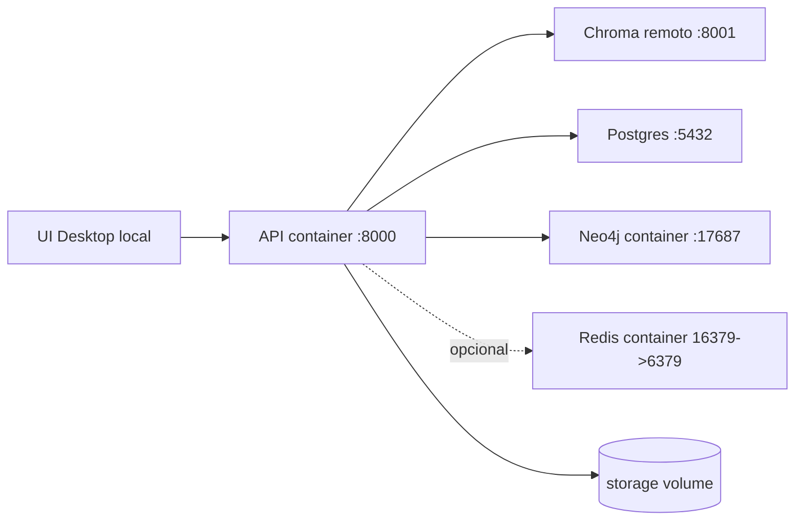
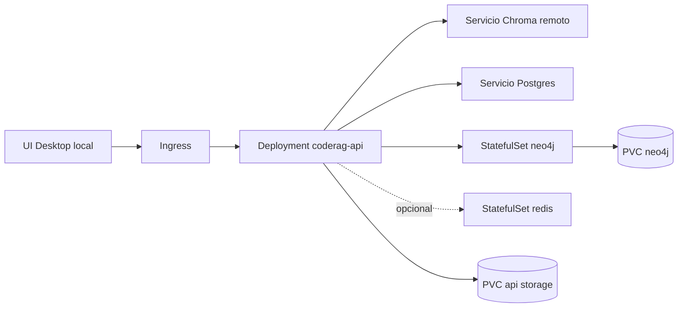
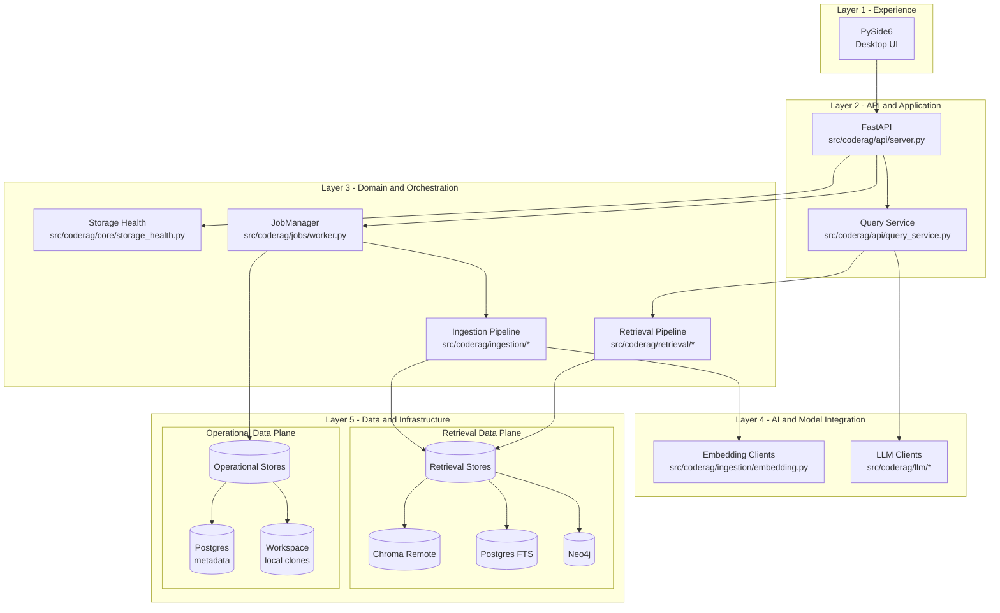
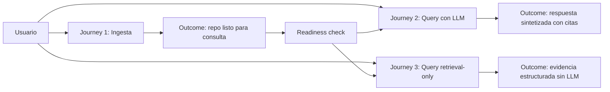
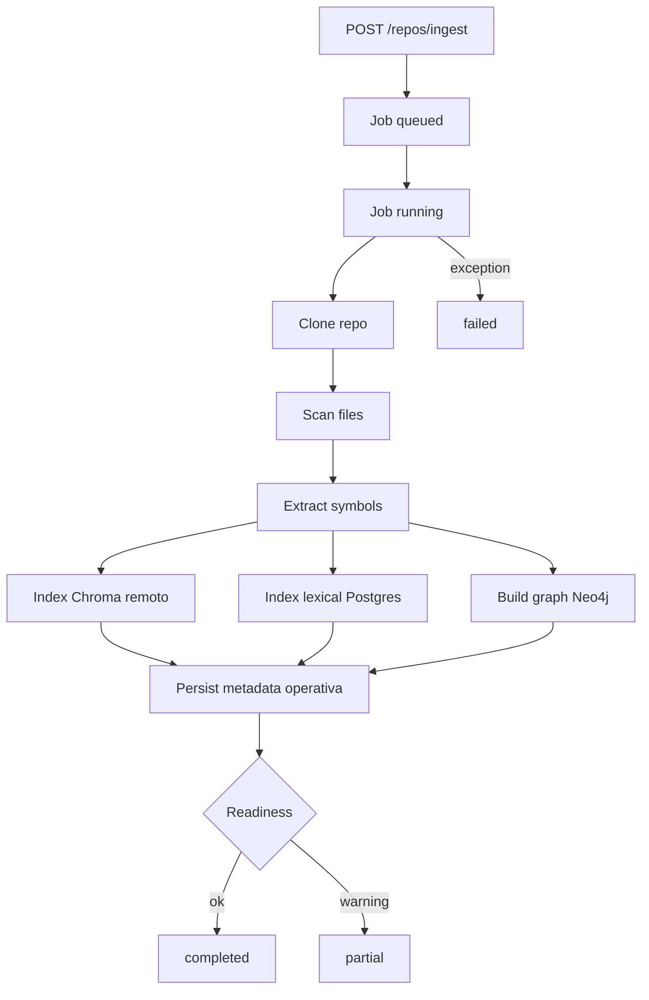
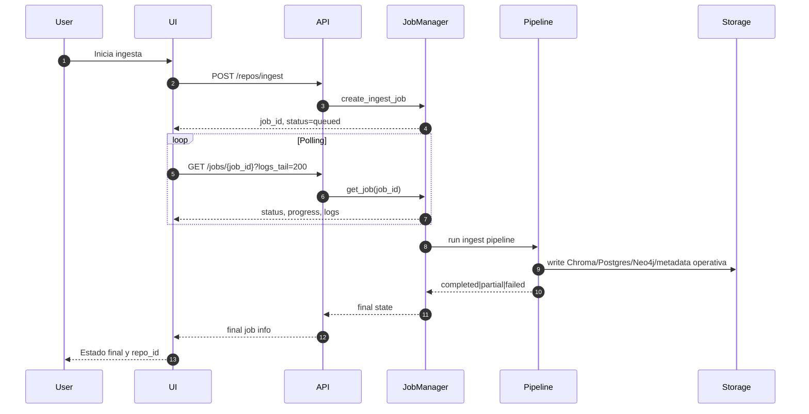
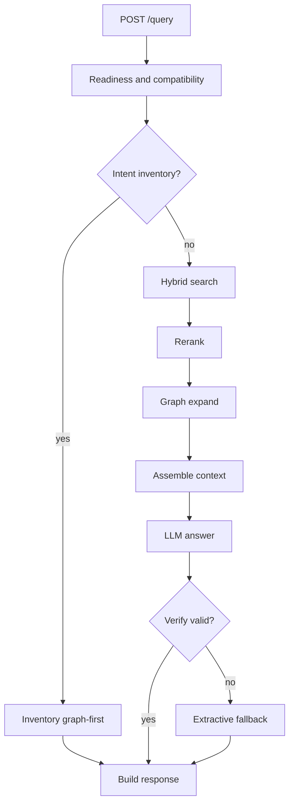
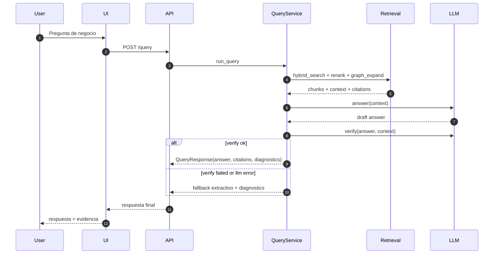
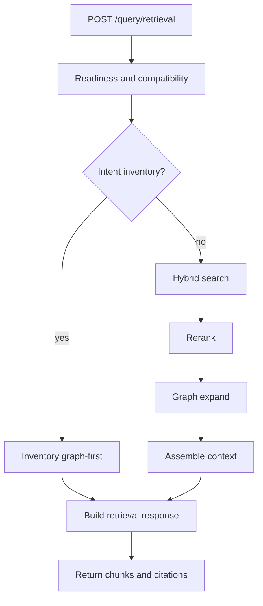
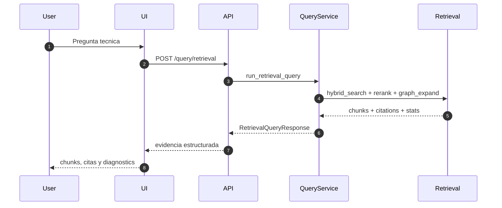

# Architecture and Customer Journeys

Documento de referencia para entender la interaccion entre usuario, UI,
API, pipeline de ingesta, retrieval y LLM.

## Reseña de Arquitectura

KDB-RAG-Repo implementa una arquitectura de tipo cliente-servidor orientada a
RAG hibrido para repositorios de codigo. El frontend de escritorio en PySide6
actua como punto de entrada para ingesta, consulta y exploracion de evidencia.
El backend expone una API FastAPI que orquesta jobs de ingesta, valida
precondiciones de storage y ejecuta rutas de consulta con o sin LLM.

La interaccion entre servicios se divide en dos grandes rutas: ingesta y query.
En ingesta, el JobManager coordina clonacion, escaneo, extraccion de simbolos,
indexacion vectorial en Chroma remoto, indexacion lexical y persistencia
operativa en Postgres, y construccion de grafo en Neo4j. En query, la API
enruta consultas al pipeline de retrieval, combina evidencia de
Chroma/Postgres/Neo4j, arma contexto y decide entre sintesis LLM o salida
retrieval-only segun endpoint y condiciones operativas.

## Descripción general del sistema

- Frontend: aplicacion PySide6 para UX operativa de ingesta y consultas.
- Backend: FastAPI para contratos HTTP y orquestacion de flujos.
- Capa de jobs: JobManager para ejecucion asincrona, estado y logs.
- Retrieval: busqueda hibrida, reranking, expansion de grafo y ensamblado de
  contexto.
- Capa LLM: clientes multi-provider para answer/verify.
- Persistencia: Chroma remoto, Postgres para metadata y corpus lexico,
    Neo4j y workspace local opcional post-ingesta.

Notas operativas:

- Query semántico, retrieval-only e inventario pueden operar sin workspace si
    Chroma, Postgres y Neo4j estan listos.
- Modo literal sigue dependiendo de workspace local porque devuelve contenido
    vivo del archivo y no usa snapshots persistidos.
- Neo4j persiste metadata adicional por archivo, incluyendo módulo y
    `purpose_summary`, para soportar discovery e inventory explain sin leer
    archivos locales.
- SQLite, BM25 local y Chroma embedded siguen existiendo como compatibilidad
    legacy en algunas rutas del codigo, pero no representan la arquitectura
    operativa principal documentada aqui.

## Topología de despliegue

### Local con Docker Compose

### Cloud con Kubernetes

## Arquitectura por capas

### Vista tecnológica por capas

### Notas sobre las capas

| Layer | Tecnologías de las capas en este proyecto | Responsabilidad principal |
| --- | --- | --- |
| Layer 1 - Experience | PySide6 | Interaccion con usuario para ingesta, consulta y visualizacion de evidencias. |
| Layer 2 - API and Application | FastAPI, Pydantic models, endpoints HTTP | Exponer contratos API, validar entradas y enrutar casos de uso. |
| Layer 3 - Domain and Orchestration | JobManager, pipeline de ingesta, pipeline de retrieval, chequeos de storage | Ejecutar logica de negocio y coordinar flujos asincronos/sincronos. |
| Layer 4 - AI and Model Integration | Clientes LLM multi-provider, clientes de embeddings | Generar respuestas/verificacion y convertir consultas/chunks a embeddings. |
| Layer 5 - Data and Infrastructure | Chroma remoto, Postgres, Neo4j, workspace local opcional | Persistir indices vectoriales, corpus lexico, metadata operativa y los datos requeridos por query/retrieval; el workspace queda reservado para modo literal y operaciones live-file. |

## Vista ejecutiva de journeys

## Journey 1: Ingesta

### Flujo de ingesta

### Secuencia de ingesta

Notas operativas de identidad de repositorio:

- `repo_id` se construye como `organizacion-repo-rama` y actúa como clave
    transversal en workspace, Postgres, Chroma y Neo4j.
- `organization` se persiste en Postgres al finalizar la ingesta; para URLs
    con jerarquías anidadas, se conserva solo el último segmento padre antes del
    nombre del repositorio.

## Journey 2: Query con LLM

### Flujo de query con LLM

### Secuencia de query con LLM

## Journey 3: Query retrieval-only

### Flujo de query retrieval-only

### Secuencia de query retrieval-only

## Componentes principales

- UI PySide6: captura inputs de ingesta/consulta y presenta evidencias.
- API FastAPI: valida precondiciones y expone contratos HTTP.
- JobManager: orquesta estados de ingesta y persistencia de logs.
- Retrieval pipeline: fusion vectorial + store lexico en Postgres + expansion
    de grafo.
- LLM clients: answer y verify en proveedores soportados.
- Storage: Chroma remoto, Postgres, Neo4j y workspace local.

## Referencias

- Endpoints y contratos: docs/API_REFERENCE.md
- Instalacion: docs/INSTALLATION.md
- Configuracion: docs/CONFIGURATION.md
- Troubleshooting: docs/TROUBLESHOOTING.md
